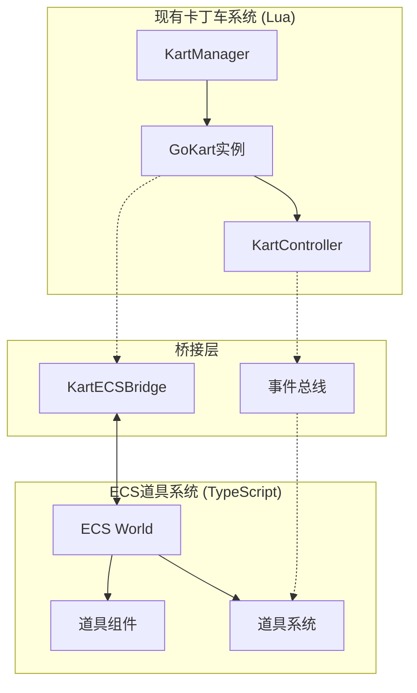

# ECS道具系统与现有卡丁车系统混合架构详细方案

## 一、现状分析

### 1.1 现有卡丁车系统架构
```
src/shared/kartEngine/
├── KartMove/
│   ├── GoKart.lua              # 基础卡丁车类
│   ├── GoPlayKart.lua          # 玩家卡丁车
│   ├── KartManager.lua         # 卡丁车管理器（单例）
│   └── KartBasicController.lua # 卡丁车控制器
├── KartClient/
│   └── KartInit.lua           # 客户端初始化
└── KartServer/
    └── NetworkManager.lua     # 网络管理
```

**特点：**
- 使用传统OOP架构（Lua实现）
- KartManager管理最多6个卡丁车实例
- 物理运动逻辑已完整实现
- 不依赖Roblox物理引擎

### 1.2 ECS系统架构
```
src/shared/ecs/
├── components/    # ECS组件
├── systems/       # ECS系统
└── start.ts       # ECS启动器
```

**使用Matter框架，组件化管理游戏实体**

## 二、混合架构设计

### 2.1 核心设计原则

1. **最小侵入性**：不修改现有卡丁车运动逻辑
2. **单向依赠**：ECS系统依赖卡丁车系统，反之不依赖
3. **清晰边界**：道具逻辑完全在ECS中，运动逻辑完全在原系统
4. **桥接通信**：通过接口层连接两个系统

### 2.2 系统架构图



## 三、桥接层实现

### 3.1 卡丁车ECS桥接器

```typescript
// src/shared/ecs/bridge/kart-ecs-bridge.ts
import { World } from "@rbxts/matter";
import type { AnyEntity } from "@rbxts/matter";

export class KartECSBridge {
    private static instance: KartECSBridge;
    private kartToEntity: Map<number, AnyEntity> = new Map();
    private entityToKart: Map<AnyEntity, number> = new Map();
    private world!: World;
    
    static getInstance(): KartECSBridge {
        if (!this.instance) {
            this.instance = new KartECSBridge();
        }
        return this.instance;
    }
    
    initialize(world: World) {
        this.world = world;
        this.setupKartEntities();
        this.setupEventListeners();
    }
    
    private setupKartEntities() {
        // 等待KartManager初始化
        task.wait(0.5);
        
        // 获取Lua侧的KartManager
        const kartManager = (_G as any).KartManager?.Instance;
        if (!kartManager) {
            warn("KartManager not found, retrying...");
            task.wait(1);
            this.setupKartEntities();
            return;
        }
        
        // 为每个卡丁车创建对应的ECS实体
        for (let i = 1; i <= 6; i++) {
            const kart = kartManager.goKart_[i];
            if (kart) {
                this.registerKart(i, kart);
            }
        }
    }
    
    registerKart(kartIndex: number, kartInstance: any): AnyEntity {
        // 检查是否已注册
        if (this.kartToEntity.has(kartIndex)) {
            return this.kartToEntity.get(kartIndex)!;
        }
        
        // 创建ECS实体
        const entity = this.world.spawn(
            KartReference({ 
                kartIndex,
                kartInstance,
                isPlayer: kartIndex === 1
            }),
            ItemHolder({
                items: new Array(3),
                currentSlot: 0,
                maxSlots: 3,
                frozen: false
            }),
            KartTransform({
                cf: kartInstance.m_kart?.GetPivot() || new CFrame()
            })
        ) as AnyEntity;
        
        // 双向映射
        this.kartToEntity.set(kartIndex, entity);
        this.entityToKart.set(entity, kartIndex);
        
        // 在Lua侧存储实体引用
        kartInstance.ecsEntity = entity;
        
        print(`Registered kart ${kartIndex} with ECS entity ${entity}`);
        return entity;
    }
    
    getEntityByKartIndex(kartIndex: number): AnyEntity | undefined {
        return this.kartToEntity.get(kartIndex);
    }
    
    getKartIndexByEntity(entity: AnyEntity): number | undefined {
        return this.entityToKart.get(entity);
    }
}
```

### 3.2 事件总线

```typescript
// src/shared/ecs/bridge/event-bus.ts
export interface ItemEvent {
    type: "USE_ITEM" | "COLLISION" | "PICKUP" | "EFFECT";
    kartIndex: number;
    data?: unknown;
    timestamp: number;
}

export class ItemEventBus {
    private static events: Array<ItemEvent> = [];
    
    static push(event: ItemEvent) {
        this.events.push(event);
    }
    
    static consume(): Array<ItemEvent> {
        const current = [...this.events];
        this.events = [];
        return current;
    }
    
    // Lua侧调用的全局函数
    static setupGlobalFunctions() {
        (_G as any).ECS_UseItem = (kartIndex: number) => {
            this.push({
                type: "USE_ITEM",
                kartIndex,
                timestamp: tick()
            });
        };
        
        (_G as any).ECS_ItemCollision = (kartIndex: number, otherId: string) => {
            this.push({
                type: "COLLISION",
                kartIndex,
                data: { otherId },
                timestamp: tick()
            });
        };
    }
}
```

### 3.3 Lua侧扩展

```lua
-- src/shared/kartEngine/KartMove/GoKart.lua 添加
function GoKart:UseItem()
    if _G.ECS_UseItem then
        -- 获取自己的索引
        local kartManager = require(script.Parent.KartManager).Instance
        for i = 1, 6 do
            if kartManager.goKart_[i] == self then
                _G.ECS_UseItem(i)
                return
            end
        end
    end
end

function GoKart:OnTriggerEnter(other)
    -- 检查是否是道具
    local itemId = other:GetAttribute("ItemEntity")
    if itemId and _G.ECS_ItemCollision then
        local kartManager = require(script.Parent.KartManager).Instance
        for i = 1, 6 do
            if kartManager.goKart_[i] == self then
                _G.ECS_ItemCollision(i, itemId)
                break
            end
        end
    end
end
```

## 四、ECS组件定义

### 4.1 核心组件

```typescript
// src/shared/ecs/components/items/kart-reference.ts
import { component } from "@rbxts/matter";

/** 卡丁车引用组件 - 连接ECS和原有系统 */
export const KartReference = component<{
    kartIndex: number;        // KartManager中的索引 (1-6)
    kartInstance: unknown;    // GoKart实例引用
    isPlayer: boolean;        // 是否是玩家
}>("KartReference");

// src/shared/ecs/components/items/item-holder.ts
/** 道具持有者组件 */
export const ItemHolder = component<{
    items: Array<string | undefined>;  // 道具槽位
    currentSlot: number;                // 当前选中槽位
    maxSlots: number;                   // 最大槽位数
    frozen: boolean;                    // 是否被冻结
    lastUsedTime?: number;              // 上次使用时间
}>("ItemHolder");

// src/shared/ecs/components/items/kart-transform.ts
/** 卡丁车位置组件 - 同步位置信息 */
export const KartTransform = component<{
    cf: CFrame;
    velocity?: Vector3;
    lastUpdate: number;
}>("KartTransform");
```

### 4.2 道具组件

```typescript
// src/shared/ecs/components/items/item-box.ts
/** 道具箱组件 */
export const ItemBox = component<{
    type: "Random" | "Weighted" | "Fixed";
    itemPool?: Array<string>;
    active: boolean;
    respawnTime: number;
    lastPickupTime: number;
    position: Vector3;
}>("ItemBox");

// src/shared/ecs/components/items/item-active.ts
/** 活跃道具组件 */
export const ItemActive = component<{
    itemType: string;
    ownerId: AnyEntity;
    ownerKartIndex: number;
    activationTime: number;
    state: "idle" | "active" | "used";
}>("ItemActive");

// src/shared/ecs/components/items/item-projectile.ts
/** 投射物组件 */
export const ItemProjectile = component<{
    speed: number;
    direction: Vector3;
    targetIndex?: number;     // 目标卡丁车索引
    tracking: number;         // 追踪强度
    damage: number;
    lifetime: number;
    spawnTime: number;
}>("ItemProjectile");

// src/shared/ecs/components/items/item-trap.ts
/** 陷阱组件 */
export const ItemTrap = component<{
    triggerRadius: number;
    armed: boolean;
    ignoreOwner: boolean;
    ownerIndex: number;
    effectType: "slip" | "spin" | "slow";
    effectDuration: number;
    effectIntensity: number;
}>("ItemTrap");

// src/shared/ecs/components/items/item-buff.ts
/** Buff组件 */
export const ItemBuff = component<{
    buffType: "speed" | "shield" | "invincible";
    targetEntity: AnyEntity;
    duration: number;
    startTime: number;
    modifiers: {
        speedMultiplier?: number;
        accelerationBonus?: number;
        shieldHits?: number;
    };
}>("ItemBuff");
```

## 五、ECS系统实现

### 5.1 位置同步系统

```typescript
// src/shared/ecs/systems/items/sync-kart-transform-system.ts
import type { World } from "@rbxts/matter";
import { KartReference, KartTransform } from "shared/ecs/components";

/**
 * 同步卡丁车位置系统
 * 从原有系统同步位置到ECS
 */
function syncKartTransform(world: World): void {
    for (const [id, kartRef, transform] of world.query(KartReference, KartTransform)) {
        const kart = kartRef.kartInstance as any;
        
        if (kart?.m_kart) {
            const newCF = kart.m_kart.GetPivot();
            const velocity = kart.m_KartRealVelocity || Vector3.zero;
            
            // 更新Transform
            world.insert(id, transform.patch({
                cf: newCF,
                velocity: velocity,
                lastUpdate: tick()
            }));
        }
    }
}

export = {
    priority: 110, // 高优先级，先同步位置
    system: syncKartTransform
};
```

### 5.2 道具拾取系统

```typescript
// src/shared/ecs/systems/items/item-pickup-system.ts
import type { World } from "@rbxts/matter";
import { ItemBox, KartTransform, ItemHolder, KartReference } from "shared/ecs/components";

function itemPickupSystem(world: World): void {
    // 更新道具箱
    for (const [boxId, itemBox] of world.query(ItemBox)) {
        if (!itemBox.active) {
            // 检查重生
            const timeSincePickup = tick() - itemBox.lastPickupTime;
            if (timeSincePickup >= itemBox.respawnTime) {
                world.insert(boxId, itemBox.patch({ active: true }));
                
                // 恢复视觉效果
                const model = world.get(boxId, Model);
                if (model?.instance) {
                    model.instance.Transparency = 0;
                }
            }
            continue;
        }
        
        // 检查碰撞
        for (const [kartId, kartTransform, holder, kartRef] of 
             world.query(KartTransform, ItemHolder, KartReference)) {
            
            const distance = (kartTransform.cf.Position - itemBox.position).Magnitude;
            
            if (distance < 5) { // 拾取范围
                // 查找空槽位
                let emptySlot = -1;
                for (let i = 0; i < holder.maxSlots; i++) {
                    if (!holder.items[i]) {
                        emptySlot = i;
                        break;
                    }
                }
                
                if (emptySlot !== -1) {
                    // 生成道具
                    const item = this.generateItem(kartRef.kartIndex, itemBox);
                    
                    // 添加道具
                    const newItems = [...holder.items];
                    newItems[emptySlot] = item;
                    
                    world.insert(kartId, holder.patch({ items: newItems }));
                    
                    // 禁用道具箱
                    world.insert(boxId, itemBox.patch({ 
                        active: false,
                        lastPickupTime: tick()
                    }));
                    
                    // 播放音效
                    this.playPickupSound(itemBox.position);
                    
                    print(`Kart ${kartRef.kartIndex} picked up ${item}`);
                }
            }
        }
    }
}

function generateItem(kartIndex: number, box: ItemBox): string {
    // 基于排名的道具生成逻辑
    const rank = this.getKartRank(kartIndex);
    
    if (box.type === "Fixed" && box.itemPool) {
        return box.itemPool[0];
    }
    
    // 权重表
    const weights = {
        "Banana": rank <= 2 ? 30 : 10,
        "Missile": rank >= 4 ? 40 : 20,
        "Boost": 30,
        "Shield": rank <= 2 ? 40 : 20,
        "Lightning": rank >= 5 ? 30 : 5
    };
    
    return this.weightedRandom(weights);
}

export = {
    priority: 100,
    system: itemPickupSystem
};
```

### 5.3 道具使用系统

```typescript
// src/shared/ecs/systems/items/item-activation-system.ts
import type { World } from "@rbxts/matter";
import { ItemEventBus } from "shared/ecs/bridge/event-bus";
import { KartECSBridge } from "shared/ecs/bridge/kart-ecs-bridge";

function itemActivationSystem(world: World): void {
    const bridge = KartECSBridge.getInstance();
    const events = ItemEventBus.consume();
    
    // 处理使用道具事件
    for (const event of events) {
        if (event.type !== "USE_ITEM") continue;
        
        const entity = bridge.getEntityByKartIndex(event.kartIndex);
        if (!entity || !world.contains(entity)) continue;
        
        const holder = world.get(entity, ItemHolder);
        const kartRef = world.get(entity, KartReference);
        const transform = world.get(entity, KartTransform);
        
        if (!holder || !kartRef || !transform) continue;
        
        const item = holder.items[holder.currentSlot];
        if (!item || holder.frozen) continue;
        
        // 检查冷却
        const now = tick();
        if (holder.lastUsedTime && now - holder.lastUsedTime < 0.5) continue;
        
        // 激活道具
        this.activateItem(world, entity, item, kartRef, transform);
        
        // 消耗道具
        const newItems = [...holder.items];
        newItems[holder.currentSlot] = undefined;
        
        world.insert(entity, holder.patch({
            items: newItems,
            lastUsedTime: now
        }));
        
        print(`Kart ${event.kartIndex} used item: ${item}`);
    }
}

function activateItem(
    world: World, 
    entity: AnyEntity, 
    itemType: string,
    kartRef: KartReference,
    transform: KartTransform
): void {
    switch (itemType) {
        case "Banana":
            this.spawnBanana(world, entity, kartRef, transform);
            break;
            
        case "Missile":
            this.spawnMissile(world, entity, kartRef, transform);
            break;
            
        case "Boost":
            this.applyBoost(world, entity, kartRef);
            break;
            
        case "Shield":
            this.applyShield(world, entity, kartRef);
            break;
            
        case "Lightning":
            this.activateLightning(world, kartRef.kartIndex);
            break;
    }
}

function spawnBanana(
    world: World,
    owner: AnyEntity,
    kartRef: KartReference,
    transform: KartTransform
): void {
    // 在车后方生成香蕉
    const backOffset = transform.cf.LookVector.mul(-3);
    const spawnPos = transform.cf.Position.add(backOffset);
    
    // 射线检测地面
    const raycast = workspace.Raycast(
        spawnPos.add(Vector3.new(0, 2, 0)),
        Vector3.new(0, -10, 0),
        new RaycastParams()
    );
    
    const groundPos = raycast ? raycast.Position : spawnPos;
    
    // 创建香蕉实体
    const banana = world.spawn(
        ItemActive({
            itemType: "Banana",
            ownerId: owner,
            ownerKartIndex: kartRef.kartIndex,
            activationTime: tick(),
            state: "idle"
        }),
        ItemTrap({
            triggerRadius: 2,
            armed: false,
            ignoreOwner: true,
            ownerIndex: kartRef.kartIndex,
            effectType: "slip",
            effectDuration: 2,
            effectIntensity: 0.8
        }),
        Transform({
            cf: new CFrame(groundPos),
            doNotReconcile: true
        })
    );
    
    // 创建模型
    this.createBananaModel(world, banana, groundPos);
    
    // 延迟激活
    task.delay(0.5, () => {
        if (world.contains(banana)) {
            const trap = world.get(banana, ItemTrap);
            if (trap) {
                world.insert(banana, trap.patch({ armed: true }));
            }
        }
    });
}

export = {
    priority: 90,
    system: itemActivationSystem
};
```

### 5.4 道具效果系统

```typescript
// src/shared/ecs/systems/items/item-effect-system.ts
import type { World } from "@rbxts/matter";
import { ItemBuff, KartReference } from "shared/ecs/components";

function itemEffectSystem(world: World): void {
    const now = tick();
    
    // 处理Buff效果
    for (const [buffId, buff] of world.query(ItemBuff)) {
        // 检查过期
        if (now >= buff.startTime + buff.duration) {
            this.removeBuff(world, buffId, buff);
            world.despawn(buffId);
            continue;
        }
        
        // 应用效果
        const target = buff.targetEntity;
        if (!world.contains(target)) continue;
        
        const kartRef = world.get(target, KartReference);
        if (!kartRef) continue;
        
        this.applyBuffToKart(kartRef.kartInstance, buff);
    }
    
    // 处理陷阱碰撞
    for (const [trapId, trap, trapTransform] of world.query(ItemTrap, Transform)) {
        if (!trap.armed) continue;
        
        // 检查所有卡丁车
        for (const [kartId, kartRef, kartTransform] of world.query(KartReference, KartTransform)) {
            // 忽略拥有者
            if (trap.ignoreOwner && kartRef.kartIndex === trap.ownerIndex) {
                continue;
            }
            
            // 距离检测
            const distance = (kartTransform.cf.Position - trapTransform.cf.Position).Magnitude;
            
            if (distance < trap.triggerRadius) {
                this.applyTrapEffect(kartRef.kartInstance, trap);
                world.despawn(trapId);
                
                print(`Kart ${kartRef.kartIndex} hit trap!`);
                break;
            }
        }
    }
}

function applyBuffToKart(kartInstance: any, buff: ItemBuff): void {
    if (!kartInstance?.controller_) return;
    
    switch (buff.buffType) {
        case "speed":
            // 修改速度属性
            if (!kartInstance.originalMaxSpeed) {
                kartInstance.originalMaxSpeed = kartInstance.controller_.maxSpeed;
            }
            kartInstance.controller_.maxSpeed = 
                kartInstance.originalMaxSpeed * (buff.modifiers.speedMultiplier || 1);
            break;
            
        case "shield":
            // 设置护盾标记
            kartInstance.hasShield = true;
            kartInstance.shieldHits = buff.modifiers.shieldHits || 3;
            break;
    }
}

function removeBuff(world: World, buffId: AnyEntity, buff: ItemBuff): void {
    const target = buff.targetEntity;
    if (!world.contains(target)) return;
    
    const kartRef = world.get(target, KartReference);
    if (!kartRef?.kartInstance) return;
    
    const kart = kartRef.kartInstance as any;
    
    switch (buff.buffType) {
        case "speed":
            // 恢复原始速度
            if (kart.originalMaxSpeed) {
                kart.controller_.maxSpeed = kart.originalMaxSpeed;
                kart.originalMaxSpeed = undefined;
            }
            break;
            
        case "shield":
            // 移除护盾
            kart.hasShield = false;
            kart.shieldHits = 0;
            break;
    }
}

function applyTrapEffect(kartInstance: any, trap: ItemTrap): void {
    if (!kartInstance?.controller_) return;
    
    switch (trap.effectType) {
        case "slip":
            // 应用打滑效果
            kartInstance.slipStartTime = tick();
            kartInstance.slipDuration = trap.effectDuration;
            kartInstance.slipIntensity = trap.effectIntensity;
            
            // 修改控制参数
            if (!kartInstance.originalGrip) {
                kartInstance.originalGrip = kartInstance.controller_.grip;
            }
            kartInstance.controller_.grip = kartInstance.originalGrip * (1 - trap.effectIntensity);
            
            // 恢复定时器
            task.delay(trap.effectDuration, () => {
                if (kartInstance.originalGrip) {
                    kartInstance.controller_.grip = kartInstance.originalGrip;
                    kartInstance.originalGrip = undefined;
                }
                kartInstance.slipStartTime = undefined;
            });
            break;
            
        case "spin":
            // 旋转效果
            kartInstance.spinStartTime = tick();
            kartInstance.spinDuration = trap.effectDuration;
            break;
    }
}

export = {
    priority: 85,
    system: itemEffectSystem
};
```

## 六、具体道具实现

### 6.1 香蕉皮（Banana）

```typescript
// src/shared/ecs/items/banana.ts
export class BananaItem {
    static readonly CONFIG = {
        modelId: "rbxassetid://123456789",
        triggerRadius: 2,
        slipDuration: 2,
        slipIntensity: 0.8,
        armDelay: 0.5,
        lifetime: 30
    };
    
    static spawn(world: World, owner: AnyEntity, position: Vector3): AnyEntity {
        const ownerRef = world.get(owner, KartReference);
        if (!ownerRef) return undefined!;
        
        const banana = world.spawn(
            ItemActive({
                itemType: "Banana",
                ownerId: owner,
                ownerKartIndex: ownerRef.kartIndex,
                activationTime: tick(),
                state: "idle"
            }),
            ItemTrap({
                triggerRadius: this.CONFIG.triggerRadius,
                armed: false,
                ignoreOwner: true,
                ownerIndex: ownerRef.kartIndex,
                effectType: "slip",
                effectDuration: this.CONFIG.slipDuration,
                effectIntensity: this.CONFIG.slipIntensity
            }),
            Transform({
                cf: new CFrame(position)
            })
        );
        
        // 创建模型
        const model = this.createModel(position);
        world.insert(banana, Model({ instance: model }));
        
        // 延迟激活
        task.delay(this.CONFIG.armDelay, () => {
            if (world.contains(banana)) {
                const trap = world.get(banana, ItemTrap);
                if (trap) {
                    world.insert(banana, trap.patch({ armed: true }));
                }
            }
        });
        
        // 自动清理
        task.delay(this.CONFIG.lifetime, () => {
            if (world.contains(banana)) {
                world.despawn(banana);
            }
        });
        
        return banana;
    }
    
    static createModel(position: Vector3): Model {
        const model = new Instance("Model");
        model.Name = "BananaItem";
        
        const part = new Instance("Part");
        part.Name = "Main";
        part.Size = new Vector3(1, 1, 1);
        part.Position = position;
        part.CanCollide = false;
        part.Anchored = true;
        part.Color = Color3.fromRGB(255, 255, 0);
        part.Parent = model;
        
        // 添加ECS标识
        model.SetAttribute("ItemEntity", true);
        model.SetAttribute("ItemType", "Banana");
        
        model.Parent = workspace;
        return model;
    }
    
    static onHit(kartInstance: any, trap: ItemTrap): void {
        // 应用打滑效果
        const controller = kartInstance.controller_;
        if (!controller) return;
        
        // 保存原始值
        const originalGrip = controller.grip;
        const originalSteer = controller.steerResponse;
        
        // 应用打滑
        controller.grip *= (1 - trap.effectIntensity);
        controller.steerResponse *= 1.5; // 转向过度
        
        // 添加旋转
        const spinForce = math.random() * 360 - 180;
        kartInstance.m_kart.AssemblyAngularVelocity = 
            Vector3.new(0, spinForce, 0);
        
        // 恢复
        task.delay(trap.effectDuration, () => {
            controller.grip = originalGrip;
            controller.steerResponse = originalSteer;
        });
    }
}
```

### 6.2 追踪导弹（Missile）

```typescript
// src/shared/ecs/items/missile.ts
export class MissileItem {
    static readonly CONFIG = {
        modelId: "rbxassetid://987654321",
        speed: 80,
        acceleration: 10,
        maxSpeed: 120,
        tracking: 0.8,
        damage: 20,
        explosionRadius: 5,
        lifetime: 10
    };
    
    static spawn(world: World, owner: AnyEntity, transform: KartTransform): AnyEntity {
        const ownerRef = world.get(owner, KartReference);
        if (!ownerRef) return undefined!;
        
        // 查找目标
        const target = this.findTarget(world, ownerRef.kartIndex);
        
        // 创建导弹
        const missile = world.spawn(
            ItemActive({
                itemType: "Missile",
                ownerId: owner,
                ownerKartIndex: ownerRef.kartIndex,
                activationTime: tick(),
                state: "active"
            }),
            ItemProjectile({
                speed: this.CONFIG.speed,
                direction: transform.cf.LookVector,
                targetIndex: target?.kartIndex,
                tracking: target ? this.CONFIG.tracking : 0,
                damage: this.CONFIG.damage,
                lifetime: this.CONFIG.lifetime,
                spawnTime: tick()
            }),
            Transform({
                cf: transform.cf.mul(new CFrame(0, 1, 2))
            }),
            Velocity({
                linear: transform.cf.LookVector.mul(this.CONFIG.speed)
            })
        );
        
        // 创建模型
        const model = this.createModel(transform.cf.Position);
        world.insert(missile, Model({ instance: model }));
        
        // 创建追踪效果
        if (target) {
            this.createTrackingBeam(model, target.kartInstance);
        }
        
        return missile;
    }
    
    static findTarget(world: World, ownerIndex: number): KartReference | undefined {
        let bestTarget: KartReference | undefined;
        let bestScore = -Infinity;
        
        const ownerEntity = KartECSBridge.getInstance().getEntityByKartIndex(ownerIndex);
        const ownerTransform = world.get(ownerEntity!, KartTransform);
        
        for (const [id, kartRef, transform] of world.query(KartReference, KartTransform)) {
            if (kartRef.kartIndex === ownerIndex) continue;
            
            const toTarget = transform.cf.Position.sub(ownerTransform!.cf.Position);
            const distance = toTarget.Magnitude;
            const angle = ownerTransform!.cf.LookVector.Dot(toTarget.Unit);
            
            // 优先前方目标
            if (angle > 0.5 && distance < 100) {
                const score = angle * 100 - distance;
                if (score > bestScore) {
                    bestScore = score;
                    bestTarget = kartRef;
                }
            }
        }
        
        return bestTarget;
    }
    
    static update(world: World, missile: AnyEntity, deltaTime: number): void {
        const projectile = world.get(missile, ItemProjectile);
        const transform = world.get(missile, Transform);
        const velocity = world.get(missile, Velocity);
        
        if (!projectile || !transform || !velocity) return;
        
        // 检查生命周期
        const age = tick() - projectile.spawnTime;
        if (age > projectile.lifetime) {
            this.explode(world, missile, transform.cf.Position);
            return;
        }
        
        // 目标追踪
        if (projectile.targetIndex && projectile.tracking > 0) {
            const targetEntity = KartECSBridge.getInstance()
                .getEntityByKartIndex(projectile.targetIndex);
            
            if (targetEntity) {
                const targetTransform = world.get(targetEntity, KartTransform);
                if (targetTransform) {
                    const toTarget = targetTransform.cf.Position.sub(transform.cf.Position);
                    const targetDir = toTarget.Unit;
                    const currentDir = velocity.linear.Unit;
                    
                    // 插值转向
                    const newDir = currentDir.Lerp(targetDir, projectile.tracking * deltaTime);
                    const speed = math.min(
                        projectile.speed + this.CONFIG.acceleration * deltaTime,
                        this.CONFIG.maxSpeed
                    );
                    
                    world.insert(missile, velocity.patch({
                        linear: newDir.mul(speed)
                    }));
                    
                    world.insert(missile, projectile.patch({ speed }));
                }
            }
        }
        
        // 碰撞检测
        for (const [kartId, kartRef, kartTransform] of world.query(KartReference, KartTransform)) {
            if (kartRef.kartIndex === projectile.ownerKartIndex) continue;
            
            const distance = (kartTransform.cf.Position - transform.cf.Position).Magnitude;
            if (distance < 3) {
                this.onHit(world, missile, kartRef);
                return;
            }
        }
        
        // 更新位置
        const newPos = transform.cf.Position.add(velocity.linear.mul(deltaTime));
        world.insert(missile, transform.patch({
            cf: new CFrame(newPos, newPos.add(velocity.linear))
        }));
    }
    
    static onHit(world: World, missile: AnyEntity, target: KartReference): void {
        const projectile = world.get(missile, ItemProjectile);
        const transform = world.get(missile, Transform);
        
        // 检查护盾
        if (target.kartInstance.hasShield) {
            target.kartInstance.shieldHits--;
            if (target.kartInstance.shieldHits <= 0) {
                target.kartInstance.hasShield = false;
            }
            
            // 偏转导弹
            this.deflect(world, missile);
            return;
        }
        
        // 应用击退
        const kart = target.kartInstance;
        const hitDirection = transform!.cf.LookVector;
        
        if (kart.controller_) {
            // 击退效果
            kart.m_KartWLVel = kart.m_KartWLVel.add(
                hitDirection.mul(projectile!.damage)
            );
            
            // 短暂失控
            kart.controller_.inputEnabled = false;
            task.delay(0.5, () => {
                kart.controller_.inputEnabled = true;
            });
        }
        
        this.explode(world, missile, transform!.cf.Position);
    }
    
    static explode(world: World, missile: AnyEntity, position: Vector3): void {
        // 创建爆炸效果
        const explosion = new Instance("Explosion");
        explosion.Position = position;
        explosion.BlastRadius = this.CONFIG.explosionRadius;
        explosion.BlastPressure = 500000;
        explosion.Parent = workspace;
        
        // 清理
        const model = world.get(missile, Model);
        if (model?.instance) {
            model.instance.Destroy();
        }
        
        world.despawn(missile);
    }
}
```

### 6.3 加速器（Boost）

```typescript
// src/shared/ecs/items/boost.ts
export class BoostItem {
    static readonly CONFIG = {
        speedMultiplier: 1.5,
        accelerationBonus: 30,
        duration: 3,
        particleEffect: "rbxassetid://456789123",
        soundId: "rbxassetid://789123456"
    };
    
    static activate(world: World, owner: AnyEntity): void {
        const kartRef = world.get(owner, KartReference);
        if (!kartRef) return;
        
        // 创建Buff实体
        const buff = world.spawn(
            ItemBuff({
                buffType: "speed",
                targetEntity: owner,
                duration: this.CONFIG.duration,
                startTime: tick(),
                modifiers: {
                    speedMultiplier: this.CONFIG.speedMultiplier,
                    accelerationBonus: this.CONFIG.accelerationBonus
                }
            })
        );
        
        // 立即应用到卡丁车
        const kart = kartRef.kartInstance;
        if (kart.controller_) {
            // 保存原始值
            kart.originalMaxSpeed = kart.controller_.maxSpeed;
            kart.originalAcceleration = kart.controller_.acceleration;
            
            // 应用加速
            kart.controller_.maxSpeed *= this.CONFIG.speedMultiplier;
            kart.controller_.acceleration += this.CONFIG.accelerationBonus;
            
            // 立即加速
            kart.m_KartWLVel = kart.m_KartWLVel.add(
                kart.m_kart.CFrame.LookVector.mul(20)
            );
        }
        
        // 视觉效果
        this.createVisualEffect(kart.m_kart);
        
        // 音效
        const sound = new Instance("Sound");
        sound.SoundId = this.CONFIG.soundId;
        sound.Volume = 0.5;
        sound.Parent = kart.m_kart;
        sound.Play();
        
        // 定时恢复
        task.delay(this.CONFIG.duration, () => {
            if (kart.originalMaxSpeed) {
                kart.controller_.maxSpeed = kart.originalMaxSpeed;
                kart.controller_.acceleration = kart.originalAcceleration;
                kart.originalMaxSpeed = undefined;
                kart.originalAcceleration = undefined;
            }
            
            world.despawn(buff);
        });
    }
    
    static createVisualEffect(kartModel: Instance): void {
        // 粒子效果
        const attachment = new Instance("Attachment");
        attachment.Parent = kartModel;
        
        const particle = new Instance("ParticleEmitter");
        particle.Texture = this.CONFIG.particleEffect;
        particle.Rate = 100;
        particle.Lifetime = new NumberRange(0.5, 1);
        particle.Speed = new NumberRange(10);
        particle.VelocityInheritance = 0.5;
        particle.Parent = attachment;
        
        // 光环效果
        const light = new Instance("PointLight");
        light.Brightness = 2;
        light.Color = Color3.fromRGB(0, 255, 255);
        light.Range = 10;
        light.Parent = kartModel;
        
        task.delay(this.CONFIG.duration, () => {
            attachment.Destroy();
            light.Destroy();
        });
    }
}
```

## 七、初始化流程

### 7.1 ECS系统启动

```typescript
// src/shared/ecs/items/init.ts
import { start } from "shared/ecs/start";
import { KartECSBridge } from "./bridge/kart-ecs-bridge";
import { ItemEventBus } from "./bridge/event-bus";

export function initItemSystem(): void {
    // 设置全局函数供Lua调用
    ItemEventBus.setupGlobalFunctions();
    
    // 获取系统容器
    const containers = [
        game.GetService("ReplicatedStorage").TS.ecs.systems.items
    ];
    
    // 启动ECS
    const startWorld = start(containers, {});
    const world = startWorld();
    
    // 初始化桥接器
    const bridge = KartECSBridge.getInstance();
    bridge.initialize(world);
    
    // 创建初始道具箱
    createItemBoxes(world);
    
    print("Item system initialized");
}

function createItemBoxes(world: World): void {
    const itemBoxPositions = [
        new Vector3(0, 5, 50),
        new Vector3(20, 5, 100),
        new Vector3(-20, 5, 150),
        // ... 更多位置
    ];
    
    for (const position of itemBoxPositions) {
        const box = world.spawn(
            ItemBox({
                type: "Weighted",
                active: true,
                respawnTime: 3,
                lastPickupTime: 0,
                position
            }),
            Transform({
                cf: new CFrame(position)
            })
        );
        
        // 创建模型
        const model = createItemBoxModel(position);
        world.insert(box, Model({ instance: model }));
    }
}
```

### 7.2 客户端初始化

```typescript
// src/client/runtime.client.ts
import { initItemSystem } from "shared/ecs/items/init";

// 等待角色加载
Players.LocalPlayer.CharacterAdded.Wait();

// 初始化道具系统
initItemSystem();
```

### 7.3 服务器初始化

```typescript
// src/server/runtime.server.ts
import { initItemSystem } from "shared/ecs/items/init";

// 初始化道具系统
initItemSystem();
```

## 八、网络同步

### 8.1 道具同步策略

```typescript
// src/server/ecs/systems/items/item-replication-system.ts
export const ItemReplicationSystem = {
    priority: 50,
    system(world: World): void {
        // 只在服务器运行
        if (!RunService.IsServer()) return;
        
        // 同步道具拾取
        for (const [id, holder, kartRef] of world.queryChanged(ItemHolder)) {
            if (holder.new && holder.old) {
                // 检测道具变化
                const changes = this.detectChanges(holder.old, holder.new);
                if (changes.length > 0) {
                    this.replicateItemChange(kartRef.kartIndex, changes);
                }
            }
        }
        
        // 同步道具位置
        for (const [id, transform, projectile] of world.query(Transform, ItemProjectile)) {
            this.replicateProjectile(id, transform, projectile);
        }
    }
};
```

## 九、性能优化

### 9.1 对象池

```typescript
// src/shared/ecs/items/object-pool.ts
export class ItemObjectPool {
    private pools = new Map<string, Array<Model>>();
    
    get(itemType: string): Model | undefined {
        const pool = this.pools.get(itemType);
        return pool?.pop();
    }
    
    return(itemType: string, model: Model): void {
        let pool = this.pools.get(itemType);
        if (!pool) {
            pool = [];
            this.pools.set(itemType, pool);
        }
        
        if (pool.size() < 10) {
            model.Parent = undefined;
            pool.push(model);
        } else {
            model.Destroy();
        }
    }
}
```

### 9.2 空间优化

```typescript
// src/shared/ecs/systems/items/spatial-culling-system.ts
export const SpatialCullingSystem = {
    priority: -100, // 低优先级
    system(world: World): void {
        const localPlayer = Players.LocalPlayer;
        if (!localPlayer?.Character) return;
        
        const playerPos = localPlayer.Character.GetPivot().Position;
        
        // 隐藏远距离道具
        for (const [id, transform, model] of world.query(Transform, Model)) {
            const distance = (transform.cf.Position - playerPos).Magnitude;
            
            if (model.instance) {
                model.instance.Parent = distance < 200 ? workspace : undefined;
            }
        }
    }
};
```

## 十、测试策略

### 10.1 单元测试

```typescript
// src/tests/items/item-system.test.ts
describe("ItemSystem", () => {
    let world: World;
    let bridge: KartECSBridge;
    
    beforeEach(() => {
        world = new World();
        bridge = KartECSBridge.getInstance();
        bridge.initialize(world);
    });
    
    it("should pick up items", () => {
        // 创建道具箱
        const box = world.spawn(
            ItemBox({ type: "Fixed", itemPool: ["Banana"], active: true }),
            Transform({ cf: new CFrame() })
        );
        
        // 创建卡丁车实体
        const kart = world.spawn(
            KartReference({ kartIndex: 1, kartInstance: {}, isPlayer: true }),
            ItemHolder({ items: [], maxSlots: 3 }),
            KartTransform({ cf: new CFrame() })
        );
        
        // 运行拾取系统
        itemPickupSystem(world);
        
        // 验证
        const holder = world.get(kart, ItemHolder);
        expect(holder?.items[0]).toBe("Banana");
    });
});
```

## 十一、常见问题处理

### 11.1 卡丁车未初始化

```typescript
// 添加重试逻辑
function waitForKartManager(callback: () => void): void {
    const check = () => {
        const kartManager = (_G as any).KartManager?.Instance;
        if (kartManager && kartManager.goKartCount_ > 0) {
            callback();
        } else {
            task.wait(0.5);
            check();
        }
    };
    check();
}
```

### 11.2 位置不同步

```typescript
// 强制同步位置
function forceSyncPosition(world: World, entity: AnyEntity): void {
    const kartRef = world.get(entity, KartReference);
    if (kartRef?.kartInstance?.m_kart) {
        const cf = kartRef.kartInstance.m_kart.GetPivot();
        world.insert(entity, KartTransform({ cf, lastUpdate: tick() }));
    }
}
```

## 十二、总结

这个混合架构方案的优势：

1. **最小改动** - 不需要重写运动系统
2. **渐进式迁移** - 可以先实现道具，后续扩展
3. **清晰分离** - 道具逻辑独立，易于维护
4. **性能优良** - ECS架构本身的优势
5. **扩展性强** - 新道具只需添加组件和系统

通过桥接层和事件系统，实现了ECS道具系统与传统卡丁车系统的完美结合。