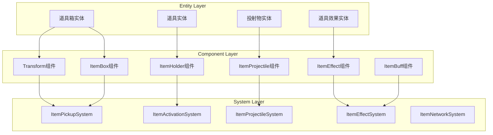

# 赛车游戏ECS道具系统架构设计文档

## 1. 概述

本文档详细描述了基于ECS（Entity-Component-System）架构的赛车游戏道具系统设计方案。该方案参考了DeathSubwayGame的ECS架构实现，结合赛车游戏的特性进行了优化和扩展。

### 1.1 设计目标

- **高性能**: 通过数据局部性和批处理优化实现60FPS稳定运行
- **可扩展**: 新道具添加无需修改核心系统
- **易维护**: 逻辑与数据分离，系统职责单一
- **网络友好**: 组件化设计便于网络同步和状态复制

### 1.2 核心特性

- 组件化道具定义
- 数据驱动的配置系统
- 事件驱动的交互机制
- 高效的碰撞检测
- 智能的网络同步

## 2. ECS架构设计

### 2.1 架构总览



### 2.2 实体定义

#### 2.2.1 道具箱实体（ItemBox Entity）
```lua
ItemBoxEntity = {
    -- 基础组件
    Transform = { Position = Vector3, Rotation = Quaternion },
    ItemBox = { Type = "Random", RespawnTime = 3.0 },
    Collider = { Shape = "Box", Size = Vector3(2, 2, 2) },
    Model = { AssetId = "ItemBoxModel" },
    
    -- 可选组件
    NetworkSync = { SyncRate = 10 },
    AudioSource = { SoundId = "ItemPickup" }
}
```

#### 2.2.2 道具持有者实体（Item Holder Entity）
```lua
ItemHolderEntity = {
    -- 玩家或AI的道具槽位
    ItemHolder = {
        Items = {}, -- 最多3个道具
        MaxSlots = 3,
        CurrentSlot = 1,
        Frozen = false
    },
    PlayerId = { Id = 0 }
}
```

#### 2.2.3 活跃道具实体（Active Item Entity）
```lua
ActiveItemEntity = {
    Transform = { Position = Vector3, Rotation = Quaternion },
    ItemActive = {
        ItemType = "Banana",
        ActivationTime = 0,
        Duration = 0,
        OwnerId = nil
    },
    -- 根据道具类型添加的组件
    ItemProjectile = nil, -- 投射物道具
    ItemTrap = nil,       -- 陷阱道具
    ItemBuff = nil        -- 增益道具
}
```

## 3. 组件详细设计

### 3.1 核心组件

#### 3.1.1 Transform组件
```lua
Transform = {
    Position = Vector3.new(0, 0, 0),
    Rotation = Quaternion.new(0, 0, 0, 1),
    Scale = Vector3.new(1, 1, 1),
    Velocity = Vector3.new(0, 0, 0),
    
    -- 缓存的世界坐标（优化用）
    WorldPosition = Vector3.new(0, 0, 0),
    WorldRotation = Quaternion.new(0, 0, 0, 1),
    
    -- 层级关系
    Parent = nil,
    Children = {}
}
```

#### 3.1.2 ItemBox组件
```lua
ItemBox = {
    -- 道具箱类型
    Type = "Random", -- "Random", "Specific", "Weighted"
    
    -- 特定道具配置（Type = "Specific"）
    SpecificItem = nil,
    
    -- 权重配置（Type = "Weighted"）
    WeightedItems = {
        {Item = "Banana", Weight = 30},
        {Item = "Missile", Weight = 20},
        {Item = "Boost", Weight = 50}
    },
    
    -- 状态
    Active = true,
    RespawnTime = 3.0,
    LastPickupTime = 0,
    
    -- 视觉效果
    RotationSpeed = 1.0,
    BobAmplitude = 0.5,
    BobFrequency = 1.0
}
```

#### 3.1.3 ItemHolder组件
```lua
ItemHolder = {
    -- 道具槽位
    Items = {
        [1] = nil, -- {Type = "Banana", Count = 1, UIIcon = "BananaIcon"}
        [2] = nil,
        [3] = nil
    },
    
    -- 槽位配置
    MaxSlots = 3,
    CurrentSlot = 1,
    
    -- 状态标记
    Frozen = false,        -- 被冻结无法使用
    AutoUse = false,       -- AI自动使用
    QuickSlotEnabled = true, -- 快速切换槽位
    
    -- 统计数据
    TotalItemsPickedUp = 0,
    TotalItemsUsed = 0,
    
    -- UI相关
    UIUpdateNeeded = false
}
```

### 3.2 道具类型组件

#### 3.2.1 投射物组件（Projectile Component）
```lua
ItemProjectile = {
    -- 运动参数
    Speed = 50,
    Acceleration = 0,
    MaxSpeed = 100,
    
    -- 目标追踪
    Target = nil,           -- 目标实体ID
    TrackingStrength = 1.0, -- 追踪强度(0-1)
    PredictiveAiming = true, -- 预判瞄准
    
    -- 轨迹
    Trajectory = "Straight", -- "Straight", "Arc", "Homing", "Spiral"
    Gravity = 0,
    
    -- 碰撞
    Damage = 10,
    ExplosionRadius = 0,
    Pierce = false,         -- 穿透
    Bounces = 0,           -- 弹跳次数
    
    -- 生命周期
    Lifetime = 10.0,
    SpawnTime = 0,
    
    -- 特效
    TrailEffect = "MissileTrail",
    ImpactEffect = "MissileExplosion",
    
    -- 防御相关
    Defendable = true,      -- 可被防御
    DefenseWindow = 0.5     -- 防御窗口时间
}
```

#### 3.2.2 陷阱组件（Trap Component）
```lua
ItemTrap = {
    -- 触发配置
    TriggerRadius = 2.0,
    TriggerDelay = 0.5,     -- 放置后延迟激活
    
    -- 效果
    SlipDuration = 2.0,     -- 打滑持续时间
    SlipIntensity = 0.8,    -- 打滑强度
    
    -- 状态
    Armed = false,          -- 是否已激活
    IgnoreOwner = true,     -- 忽略放置者
    IgnoreDuration = 2.0,   -- 忽略时长
    
    -- 视觉
    Visible = true,
    WarningRadius = 5.0,    -- 警告范围
    
    -- 生命周期
    Lifetime = 30.0,        -- 最大存在时间
    MaxTriggers = 1         -- 最大触发次数
}
```

#### 3.2.3 增益组件（Buff Component）
```lua
ItemBuff = {
    -- Buff类型
    BuffType = "Speed",     -- "Speed", "Shield", "Invincible"
    
    -- 效果参数
    Modifiers = {
        Speed = {
            Type = "Multiplicative", -- "Additive", "Multiplicative"
            Value = 1.5,
            Duration = 5.0
        },
        Acceleration = {
            Type = "Additive",
            Value = 10,
            Duration = 5.0
        }
    },
    
    -- 叠加规则
    Stackable = false,
    MaxStacks = 1,
    StackBehavior = "Refresh", -- "Refresh", "Extend", "Separate"
    
    -- 视觉效果
    VisualEffect = "SpeedBoostAura",
    UIIndicator = "SpeedBoostIcon",
    
    -- 状态
    Active = false,
    ActivationTime = 0,
    ExpirationTime = 0
}
```

#### 3.2.4 区域效果组件（Area Effect Component）
```lua
ItemAreaEffect = {
    -- 区域配置
    Shape = "Sphere",       -- "Sphere", "Box", "Cylinder"
    Radius = 10.0,
    Height = 5.0,           -- 用于Cylinder
    
    -- 效果类型
    EffectType = "Slow",    -- "Slow", "Damage", "Blind"
    
    -- 效果参数
    TickRate = 0.5,         -- 每0.5秒触发一次
    TickDamage = 5,
    SlowPercent = 0.3,
    
    -- 目标过滤
    AffectEnemies = true,
    AffectAllies = false,
    AffectSelf = false,
    
    -- 持续时间
    Duration = 10.0,
    FadeInTime = 0.5,
    FadeOutTime = 1.0
}
```

### 3.3 网络同步组件

#### 3.3.1 网络同步组件
```lua
ItemNetworkSync = {
    -- 同步配置
    SyncRate = 10,          -- Hz
    Priority = 1,           -- 同步优先级
    Reliable = false,       -- 可靠传输
    
    -- 同步字段
    SyncedFields = {
        "Transform.Position",
        "Transform.Rotation",
        "ItemActive.Duration"
    },
    
    -- 状态
    LastSyncTime = 0,
    DirtyFields = {},
    PendingUpdates = {},
    
    -- 预测
    PredictionEnabled = true,
    InterpolationDelay = 0.1,
    
    -- 权限
    Authority = "Server",   -- "Server", "Client", "Shared"
    OwnerId = nil
}
```

#### 3.3.2 复制组件（Replication Component）
```lua
ItemReplication = {
    -- 复制模式
    Mode = "Reliable",      -- "Reliable", "Unreliable", "Ordered"
    
    -- 复制范围
    ReplicationRadius = 100, -- 只同步范围内的道具
    LODDistance = {
        High = 30,          -- 全细节
        Medium = 60,        -- 中等细节
        Low = 100           -- 低细节
    },
    
    -- 复制队列
    Queue = {},
    MaxQueueSize = 100,
    
    -- 增量同步
    DeltaCompression = true,
    LastState = {},
    
    -- 统计
    BytesSent = 0,
    BytesReceived = 0,
    PacketsLost = 0
}
```

## 4. 系统详细设计

### 4.1 道具拾取系统（ItemPickupSystem）

#### 4.1.1 系统概述
负责处理玩家与道具箱的碰撞检测、道具生成和分配。

#### 4.1.2 核心逻辑
```lua
ItemPickupSystem = {
    Priority = 100, -- 系统执行优先级
    
    Update = function(world, deltaTime, state)
        -- 1. 更新道具箱动画
        for id, transform, itemBox in world:query(Transform, ItemBox) do
            if itemBox.Active then
                -- 旋转动画
                transform.Rotation = transform.Rotation * 
                    Quaternion.fromAxisAngle(Vector3.UP, itemBox.RotationSpeed * deltaTime)
                
                -- 上下浮动
                local bob = math.sin(state.Time * itemBox.BobFrequency) * itemBox.BobAmplitude
                transform.Position = transform.Position + Vector3.new(0, bob * deltaTime, 0)
            end
        end
        
        -- 2. 检测碰撞
        local collisions = self:detectCollisions(world, state)
        
        -- 3. 处理道具拾取
        for _, collision in ipairs(collisions) do
            self:handlePickup(world, collision, state)
        end
        
        -- 4. 处理道具箱重生
        for id, itemBox in world:query(ItemBox) do
            if not itemBox.Active and 
               state.Time - itemBox.LastPickupTime > itemBox.RespawnTime then
                self:respawnItemBox(world, id, itemBox)
            end
        end
    end,
    
    detectCollisions = function(self, world, state)
        local collisions = {}
        
        -- 使用空间分区优化
        local spatialHash = self:buildSpatialHash(world)
        
        for kartId, kartTransform, kartCollider in world:query(Transform, KartCollider) do
            local nearbyBoxes = spatialHash:getNearby(kartTransform.Position)
            
            for _, boxId in ipairs(nearbyBoxes) do
                local boxTransform = world:get(boxId, Transform)
                local boxCollider = world:get(boxId, Collider)
                local itemBox = world:get(boxId, ItemBox)
                
                if itemBox.Active and self:checkCollision(
                    kartTransform, kartCollider,
                    boxTransform, boxCollider
                ) then
                    table.insert(collisions, {
                        KartId = kartId,
                        BoxId = boxId
                    })
                end
            end
        end
        
        return collisions
    end,
    
    handlePickup = function(self, world, collision, state)
        local kartId = collision.KartId
        local boxId = collision.BoxId
        
        -- 获取组件
        local itemHolder = world:get(kartId, ItemHolder)
        local itemBox = world:get(boxId, ItemBox)
        local kartInfo = world:get(kartId, KartInfo)
        
        -- 检查是否有空槽位
        local emptySlot = self:findEmptySlot(itemHolder)
        if not emptySlot then
            return -- 槽位已满
        end
        
        -- 生成道具
        local item = self:generateItem(itemBox, kartInfo, state)
        
        -- 添加到槽位
        itemHolder.Items[emptySlot] = {
            Type = item.Type,
            Count = item.Count or 1,
            UIIcon = item.Icon,
            Params = item.Params
        }
        
        -- 标记UI更新
        itemHolder.UIUpdateNeeded = true
        itemHolder.TotalItemsPickedUp = itemHolder.TotalItemsPickedUp + 1
        
        -- 禁用道具箱
        itemBox.Active = false
        itemBox.LastPickupTime = state.Time
        
        -- 发送事件
        world:insert(kartId, ItemSignals, {
            OnPickup = {
                ItemType = item.Type,
                SlotIndex = emptySlot,
                Time = state.Time
            }
        })
        
        -- 播放音效
        self:playPickupSound(world, boxId)
        
        -- 网络同步
        if state.IsServer then
            self:syncPickup(world, kartId, item, state)
        end
    end,
    
    generateItem = function(self, itemBox, kartInfo, state)
        local itemType = nil
        
        if itemBox.Type == "Random" then
            -- 根据排名获取道具概率表
            local rank = kartInfo.CurrentRank or 1
            local probTable = self:getProbabilityTable(rank, state.PlayerCount)
            
            -- 随机选择
            itemType = self:weightedRandom(probTable)
            
        elseif itemBox.Type == "Specific" then
            itemType = itemBox.SpecificItem
            
        elseif itemBox.Type == "Weighted" then
            itemType = self:weightedRandomFromList(itemBox.WeightedItems)
        end
        
        -- 获取道具配置
        local config = ItemConfigs[itemType]
        
        return {
            Type = itemType,
            Count = config.DefaultCount or 1,
            Icon = config.UIIcon,
            Params = config.DefaultParams or {}
        }
    end,
    
    getProbabilityTable = function(self, rank, playerCount)
        -- 动态概率表
        if playerCount <= 2 then
            return ItemProbability.TwoPlayers[rank] or ItemProbability.TwoPlayers.Default
        elseif playerCount <= 3 then
            return ItemProbability.ThreePlayers[rank] or ItemProbability.ThreePlayers.Default
        else
            if rank == 1 then
                return ItemProbability.MultiPlayers.First
            elseif rank <= 3 then
                return ItemProbability.MultiPlayers.Middle
            else
                return ItemProbability.MultiPlayers.Last
            end
        end
    end
}
```

### 4.2 道具激活系统（ItemActivationSystem）

#### 4.2.1 系统概述
处理道具的使用逻辑，创建道具实体，应用道具效果。

#### 4.2.2 核心逻辑
```lua
ItemActivationSystem = {
    Priority = 90,
    
    Update = function(world, deltaTime, state)
        -- 1. 处理道具使用输入
        for kartId, itemHolder, input in world:query(ItemHolder, InputComponent) do
            if input.UseItem and not itemHolder.Frozen then
                self:useItem(world, kartId, itemHolder, state)
            end
            
            if input.SwitchItem then
                self:switchSlot(world, kartId, itemHolder)
            end
        end
        
        -- 2. AI自动使用道具
        for kartId, itemHolder, aiController in world:query(ItemHolder, AIController) do
            if itemHolder.AutoUse then
                self:aiUseItem(world, kartId, itemHolder, aiController, state)
            end
        end
        
        -- 3. 更新活跃道具
        for itemId, itemActive in world:query(ItemActive) do
            if itemActive.Duration > 0 then
                itemActive.Duration = itemActive.Duration - deltaTime
                
                if itemActive.Duration <= 0 then
                    self:deactivateItem(world, itemId, itemActive)
                end
            end
        end
    end,
    
    useItem = function(self, world, kartId, itemHolder, state)
        local slot = itemHolder.CurrentSlot
        local item = itemHolder.Items[slot]
        
        if not item then
            return -- 槽位为空
        end
        
        -- 获取道具配置
        local config = ItemConfigs[item.Type]
        
        -- 检查使用条件
        if not self:checkUsageConditions(world, kartId, config, state) then
            return
        end
        
        -- 创建道具实体
        local itemEntity = self:createItemEntity(world, kartId, item, config, state)
        
        -- 根据道具类型添加组件
        if config.Category == "Projectile" then
            self:setupProjectile(world, itemEntity, kartId, config, state)
            
        elseif config.Category == "Trap" then
            self:setupTrap(world, itemEntity, kartId, config, state)
            
        elseif config.Category == "Buff" then
            self:setupBuff(world, itemEntity, kartId, config, state)
            
        elseif config.Category == "Instant" then
            self:applyInstantEffect(world, kartId, config, state)
            world:despawn(itemEntity) -- 立即销毁
        end
        
        -- 消耗道具
        item.Count = item.Count - 1
        if item.Count <= 0 then
            itemHolder.Items[slot] = nil
        end
        
        -- 更新统计
        itemHolder.TotalItemsUsed = itemHolder.TotalItemsUsed + 1
        itemHolder.UIUpdateNeeded = true
        
        -- 发送使用事件
        world:insert(kartId, ItemSignals, {
            OnUse = {
                ItemType = item.Type,
                ItemEntity = itemEntity,
                Time = state.Time
            }
        })
        
        -- 网络同步
        if state.IsServer then
            self:syncItemUse(world, kartId, item.Type, itemEntity, state)
        end
    end,
    
    createItemEntity = function(self, world, ownerId, item, config, state)
        local ownerTransform = world:get(ownerId, Transform)
        
        -- 创建道具实体
        local itemEntity = world:spawn(
            Transform({
                Position = ownerTransform.Position + config.SpawnOffset,
                Rotation = ownerTransform.Rotation
            }),
            ItemActive({
                ItemType = item.Type,
                ActivationTime = state.Time,
                Duration = config.Duration or 0,
                OwnerId = ownerId
            }),
            Model({
                AssetId = config.ModelId
            })
        )
        
        return itemEntity
    end,
    
    setupProjectile = function(self, world, itemEntity, ownerId, config, state)
        local ownerTransform = world:get(ownerId, Transform)
        local ownerVelocity = world:get(ownerId, Velocity) or Vector3.ZERO
        
        -- 寻找目标
        local target = self:findBestTarget(world, ownerId, config, state)
        
        -- 添加投射物组件
        world:insert(itemEntity, ItemProjectile, {
            Speed = config.ProjectileSpeed,
            Target = target,
            TrackingStrength = config.TrackingStrength or 0,
            Damage = config.Damage,
            Lifetime = config.Lifetime or 10,
            SpawnTime = state.Time,
            Trajectory = config.Trajectory or "Straight",
            Defendable = config.Defendable
        })
        
        -- 添加碰撞器
        world:insert(itemEntity, Collider, {
            Shape = "Sphere",
            Radius = config.CollisionRadius or 1
        })
        
        -- 初始速度
        local direction = ownerTransform.Rotation:GetForwardVector()
        world:insert(itemEntity, Velocity, {
            Linear = direction * config.ProjectileSpeed + ownerVelocity
        })
    end,
    
    setupTrap = function(self, world, itemEntity, ownerId, config, state)
        -- 添加陷阱组件
        world:insert(itemEntity, ItemTrap, {
            TriggerRadius = config.TriggerRadius,
            TriggerDelay = config.TriggerDelay or 0.5,
            SlipDuration = config.SlipDuration,
            SlipIntensity = config.SlipIntensity,
            Armed = false,
            IgnoreOwner = true,
            IgnoreDuration = config.IgnoreDuration or 2,
            Lifetime = config.TrapLifetime or 30,
            MaxTriggers = config.MaxTriggers or 1
        })
        
        -- 添加触发器
        world:insert(itemEntity, Trigger, {
            Shape = "Sphere",
            Radius = config.TriggerRadius,
            OnEnter = function(other)
                self:onTrapTriggered(world, itemEntity, other, state)
            end
        })
        
        -- 延迟激活
        world:insert(itemEntity, TimerDelay, {
            TriggerTime = state.Time + (config.TriggerDelay or 0.5),
            Func = function()
                local trap = world:get(itemEntity, ItemTrap)
                if trap then
                    trap.Armed = true
                end
            end
        })
    end,
    
    setupBuff = function(self, world, itemEntity, kartId, config, state)
        -- 添加Buff组件
        local buff = ItemBuff({
            BuffType = config.BuffType,
            Modifiers = config.Modifiers,
            Stackable = config.Stackable or false,
            MaxStacks = config.MaxStacks or 1,
            StackBehavior = config.StackBehavior or "Refresh",
            Active = true,
            ActivationTime = state.Time,
            ExpirationTime = state.Time + config.Duration
        })
        
        world:insert(itemEntity, buff)
        
        -- 直接应用到目标
        self:applyBuffToTarget(world, kartId, buff, state)
        
        -- 添加视觉效果
        if config.VisualEffect then
            world:insert(kartId, VisualEffect, {
                EffectId = config.VisualEffect,
                Duration = config.Duration
            })
        end
    end,
    
    aiUseItem = function(self, world, kartId, itemHolder, aiController, state)
        -- AI道具使用决策
        local item = itemHolder.Items[itemHolder.CurrentSlot]
        if not item then
            return
        end
        
        local config = ItemConfigs[item.Type]
        local useScore = self:calculateUseScore(world, kartId, item.Type, aiController, state)
        
        if useScore > aiController.ItemUseThreshold then
            self:useItem(world, kartId, itemHolder, state)
        end
    end,
    
    calculateUseScore = function(self, world, kartId, itemType, aiController, state)
        local score = 0
        local kartInfo = world:get(kartId, KartInfo)
        
        -- 基于道具类型和游戏状态计算使用分数
        if itemType == "Missile" then
            -- 有前方目标时分数高
            local target = self:findForwardTarget(world, kartId)
            if target then
                score = 80
                local distance = self:getDistance(world, kartId, target)
                if distance < 20 then
                    score = 100 -- 近距离更高分
                end
            end
            
        elseif itemType == "Banana" then
            -- 领先时在关键位置使用
            if kartInfo.CurrentRank == 1 then
                score = 70
                if self:isNearCorner(world, kartId) then
                    score = 90 -- 弯道处更有效
                end
            end
            
        elseif itemType == "Boost" then
            -- 直道或落后时使用
            if kartInfo.CurrentRank > 3 then
                score = 90 -- 落后时优先使用
            elseif self:isOnStraight(world, kartId) then
                score = 80 -- 直道使用
            end
            
        elseif itemType == "Shield" then
            -- 有威胁时使用
            if self:hasIncomingThreat(world, kartId) then
                score = 100 -- 立即使用防御
            end
        end
        
        return score
    end
}
```

### 4.3 投射物系统（ItemProjectileSystem）

#### 4.3.1 系统概述
处理投射物的移动、追踪、碰撞检测和伤害计算。

#### 4.3.2 核心逻辑
```lua
ItemProjectileSystem = {
    Priority = 80,
    
    Update = function(world, deltaTime, state)
        -- 处理所有投射物
        for projectileId, transform, projectile, velocity in 
            world:query(Transform, ItemProjectile, Velocity) do
            
            -- 1. 更新生命周期
            local age = state.Time - projectile.SpawnTime
            if age > projectile.Lifetime then
                self:destroyProjectile(world, projectileId, "Timeout")
                goto continue
            end
            
            -- 2. 目标追踪
            if projectile.Target and projectile.TrackingStrength > 0 then
                self:updateTracking(world, projectileId, transform, projectile, velocity, deltaTime)
            end
            
            -- 3. 轨迹更新
            self:updateTrajectory(world, transform, projectile, velocity, deltaTime)
            
            -- 4. 碰撞检测
            local hit = self:checkCollision(world, projectileId, transform, projectile)
            if hit then
                self:handleImpact(world, projectileId, projectile, hit, state)
                goto continue
            end
            
            -- 5. 更新位置
            transform.Position = transform.Position + velocity.Linear * deltaTime
            
            ::continue::
        end
    end,
    
    updateTracking = function(self, world, projectileId, transform, projectile, velocity, deltaTime)
        local targetTransform = world:get(projectile.Target, Transform)
        if not targetTransform then
            projectile.Target = nil -- 目标已销毁
            return
        end
        
        -- 计算目标方向
        local toTarget = targetTransform.Position - transform.Position
        local distance = toTarget:Magnitude()
        
        if distance < 0.01 then
            return -- 避免除零
        end
        
        toTarget = toTarget:Normalize()
        
        -- 预测目标位置（如果启用）
        if projectile.PredictiveAiming then
            local targetVelocity = world:get(projectile.Target, Velocity)
            if targetVelocity then
                local timeToHit = distance / projectile.Speed
                local predictedPos = targetTransform.Position + targetVelocity.Linear * timeToHit
                toTarget = (predictedPos - transform.Position):Normalize()
            end
        end
        
        -- 平滑转向
        local currentDir = velocity.Linear:Normalize()
        local newDir = currentDir:Lerp(toTarget, projectile.TrackingStrength * deltaTime)
        
        -- 更新速度
        velocity.Linear = newDir * projectile.Speed
        
        -- 更新朝向
        transform.Rotation = Quaternion.LookRotation(newDir)
    end,
    
    updateTrajectory = function(self, world, transform, projectile, velocity, deltaTime)
        if projectile.Trajectory == "Arc" then
            -- 应用重力
            velocity.Linear = velocity.Linear + Vector3.new(0, -projectile.Gravity * deltaTime, 0)
            
        elseif projectile.Trajectory == "Spiral" then
            -- 螺旋运动
            local time = projectile.SpawnTime
            local spiralRadius = 2
            local spiralSpeed = 5
            
            local offset = Vector3.new(
                math.sin(time * spiralSpeed) * spiralRadius,
                0,
                math.cos(time * spiralSpeed) * spiralRadius
            )
            
            velocity.Linear = velocity.Linear + offset * deltaTime
            
        elseif projectile.Trajectory == "Wave" then
            -- 波浪运动
            local time = projectile.SpawnTime
            local waveAmp = 3
            local waveFreq = 2
            
            local offset = Vector3.new(
                0,
                math.sin(time * waveFreq) * waveAmp,
                0
            )
            
            velocity.Linear = velocity.Linear + offset * deltaTime
        end
        
        -- 限制最大速度
        if velocity.Linear:Magnitude() > projectile.MaxSpeed then
            velocity.Linear = velocity.Linear:Normalize() * projectile.MaxSpeed
        end
    end,
    
    checkCollision = function(self, world, projectileId, transform, projectile)
        -- 使用空间哈希加速碰撞检测
        local nearbyEntities = self:getNearbyEntities(world, transform.Position, 5)
        
        for _, targetId in ipairs(nearbyEntities) do
            -- 跳过自己和拥有者
            if targetId == projectileId or targetId == projectile.OwnerId then
                goto continue
            end
            
            local targetTransform = world:get(targetId, Transform)
            local targetCollider = world:get(targetId, Collider)
            
            if targetTransform and targetCollider then
                local distance = (targetTransform.Position - transform.Position):Magnitude()
                
                if distance < (projectile.CollisionRadius + targetCollider.Radius) then
                    -- 检查是否可以被防御
                    if projectile.Defendable then
                        local defense = self:checkDefense(world, targetId, projectileId)
                        if defense then
                            return {
                                Type = "Defended",
                                TargetId = targetId,
                                Position = transform.Position
                            }
                        end
                    end
                    
                    return {
                        Type = "Hit",
                        TargetId = targetId,
                        Position = transform.Position
                    }
                end
            end
            
            ::continue::
        end
        
        return nil
    end,
    
    handleImpact = function(self, world, projectileId, projectile, hit, state)
        if hit.Type == "Hit" then
            -- 应用伤害
            self:applyDamage(world, hit.TargetId, projectile.Damage, projectile.OwnerId)
            
            -- 爆炸伤害
            if projectile.ExplosionRadius > 0 then
                self:applyExplosionDamage(world, hit.Position, projectile)
            end
            
            -- 播放特效
            self:playImpactEffect(world, hit.Position, projectile.ImpactEffect)
            
            -- 发送命中事件
            world:insert(projectile.OwnerId, ItemSignals, {
                OnHit = {
                    ProjectileType = projectile.Type,
                    TargetId = hit.TargetId,
                    Damage = projectile.Damage,
                    Time = state.Time
                }
            })
            
        elseif hit.Type == "Defended" then
            -- 防御成功
            self:playDefenseEffect(world, hit.Position)
            
            -- 发送防御事件
            world:insert(hit.TargetId, ItemSignals, {
                OnDefend = {
                    ProjectileType = projectile.Type,
                    AttackerId = projectile.OwnerId,
                    Time = state.Time
                }
            })
        end
        
        -- 处理穿透
        if projectile.Pierce and projectile.PierceCount > 0 then
            projectile.PierceCount = projectile.PierceCount - 1
            -- 继续飞行
        else
            -- 销毁投射物
            self:destroyProjectile(world, projectileId, "Impact")
        end
    end,
    
    checkDefense = function(self, world, targetId, projectileId)
        -- 检查水导弹防御
        local defenseComponent = world:get(targetId, MissileDefense)
        if defenseComponent and defenseComponent.Active then
            local projectile = world:get(projectileId, ItemProjectile)
            
            -- 检查防御时间窗口
            if defenseComponent.DefenseStartTime + projectile.DefenseWindow > world:get(GameTimer).Time then
                return true
            end
        end
        
        -- 检查护盾
        local shield = world:get(targetId, ShieldBuff)
        if shield and shield.Active then
            shield.BlocksRemaining = shield.BlocksRemaining - 1
            if shield.BlocksRemaining <= 0 then
                world:remove(targetId, ShieldBuff)
            end
            return true
        end
        
        return false
    end
}
```

### 4.4 道具效果系统（ItemEffectSystem）

#### 4.4.1 系统概述
管理和应用各种道具效果，包括Buff、Debuff和特殊效果。

#### 4.4.2 核心逻辑
```lua
ItemEffectSystem = {
    Priority = 70,
    
    Update = function(world, deltaTime, state)
        -- 1. 处理Buff效果
        self:updateBuffs(world, deltaTime, state)
        
        -- 2. 处理区域效果
        self:updateAreaEffects(world, deltaTime, state)
        
        -- 3. 处理陷阱效果
        self:updateTraps(world, deltaTime, state)
        
        -- 4. 清理过期效果
        self:cleanupExpiredEffects(world, state)
    end,
    
    updateBuffs = function(self, world, deltaTime, state)
        for kartId, buffCollection in world:query(BuffCollectionComponent) do
            for i = #buffCollection.Buffs, 1, -1 do
                local buff = buffCollection.Buffs[i]
                
                -- 更新持续时间
                if buff.Duration > 0 then
                    buff.Duration = buff.Duration - deltaTime
                    
                    if buff.Duration <= 0 then
                        -- Buff过期
                        self:removeBuff(world, kartId, buff, i)
                        table.remove(buffCollection.Buffs, i)
                    else
                        -- 应用Buff效果
                        self:applyBuffEffect(world, kartId, buff, deltaTime)
                    end
                end
            end
        end
    end,
    
    applyBuffEffect = function(self, world, kartId, buff, deltaTime)
        local kartStats = world:get(kartId, KartStats)
        if not kartStats then return end
        
        -- 应用属性修改
        for stat, modifier in pairs(buff.Modifiers) do
            if modifier.Type == "Additive" then
                kartStats[stat] = kartStats.Base[stat] + modifier.Value
                
            elseif modifier.Type == "Multiplicative" then
                kartStats[stat] = kartStats.Base[stat] * modifier.Value
                
            elseif modifier.Type == "Override" then
                kartStats[stat] = modifier.Value
            end
        end
        
        -- 特殊效果处理
        if buff.BuffType == "Speed" then
            self:applySpeedBoost(world, kartId, buff)
            
        elseif buff.BuffType == "Shield" then
            self:maintainShield(world, kartId, buff)
            
        elseif buff.BuffType == "Invincible" then
            self:applyInvincibility(world, kartId, buff)
        end
    end,
    
    updateAreaEffects = function(self, world, deltaTime, state)
        for areaId, transform, areaEffect in world:query(Transform, ItemAreaEffect) do
            -- 更新持续时间
            areaEffect.Duration = areaEffect.Duration - deltaTime
            
            if areaEffect.Duration <= 0 then
                -- 淡出效果
                if areaEffect.FadeOutTime > 0 then
                    -- 逐渐减弱效果
                    areaEffect.Intensity = areaEffect.Intensity * (1 - deltaTime / areaEffect.FadeOutTime)
                    areaEffect.FadeOutTime = areaEffect.FadeOutTime - deltaTime
                    
                    if areaEffect.FadeOutTime <= 0 then
                        world:despawn(areaId)
                    end
                else
                    world:despawn(areaId)
                end
            else
                -- 应用区域效果
                self:applyAreaEffect(world, areaId, transform, areaEffect, deltaTime, state)
            end
        end
    end,
    
    applyAreaEffect = function(self, world, areaId, transform, areaEffect, deltaTime, state)
        -- Tick计时
        areaEffect.NextTick = (areaEffect.NextTick or 0) - deltaTime
        if areaEffect.NextTick > 0 then
            return
        end
        areaEffect.NextTick = areaEffect.TickRate
        
        -- 获取区域内的目标
        local targets = self:getTargetsInArea(world, transform.Position, areaEffect)
        
        for _, targetId in ipairs(targets) do
            -- 过滤目标
            if not self:shouldAffectTarget(world, areaId, targetId, areaEffect) then
                goto continue
            end
            
            -- 应用效果
            if areaEffect.EffectType == "Damage" then
                self:applyDamage(world, targetId, areaEffect.TickDamage)
                
            elseif areaEffect.EffectType == "Slow" then
                self:applySlow(world, targetId, areaEffect.SlowPercent, areaEffect.TickRate)
                
            elseif areaEffect.EffectType == "Blind" then
                self:applyBlind(world, targetId, areaEffect.TickRate)
            end
            
            ::continue::
        end
    end,
    
    updateTraps = function(self, world, deltaTime, state)
        for trapId, transform, trap in world:query(Transform, ItemTrap) do
            -- 更新生命周期
            trap.Lifetime = trap.Lifetime - deltaTime
            if trap.Lifetime <= 0 then
                world:despawn(trapId)
                goto continue
            end
            
            -- 检查激活状态
            if not trap.Armed then
                goto continue
            end
            
            -- 检测触发
            local triggered = self:checkTrapTrigger(world, trapId, transform, trap)
            if triggered then
                self:triggerTrap(world, trapId, trap, triggered, state)
                
                -- 减少触发次数
                trap.MaxTriggers = trap.MaxTriggers - 1
                if trap.MaxTriggers <= 0 then
                    world:despawn(trapId)
                end
            end
            
            ::continue::
        end
    end,
    
    checkTrapTrigger = function(self, world, trapId, transform, trap)
        local nearbyKarts = self:getNearbyEntities(world, transform.Position, trap.TriggerRadius)
        
        for _, kartId in ipairs(nearbyKarts) do
            -- 检查是否应该忽略
            if trap.IgnoreOwner and kartId == trap.OwnerId then
                local ignoreTime = state.Time - trap.PlacedTime
                if ignoreTime < trap.IgnoreDuration then
                    goto continue
                end
            end
            
            -- 检查是否在触发范围内
            local kartTransform = world:get(kartId, Transform)
            if kartTransform then
                local distance = (kartTransform.Position - transform.Position):Magnitude()
                if distance < trap.TriggerRadius then
                    return kartId
                end
            end
            
            ::continue::
        end
        
        return nil
    end,
    
    triggerTrap = function(self, world, trapId, trap, triggeredBy, state)
        -- 香蕉皮效果
        if trap.TrapType == "Banana" then
            -- 使目标打滑
            world:insert(triggeredBy, SlipEffect, {
                Duration = trap.SlipDuration,
                Intensity = trap.SlipIntensity,
                StartTime = state.Time
            })
            
            -- 播放打滑动画
            self:playSlipAnimation(world, triggeredBy)
            
            -- 播放音效
            self:playTrapSound(world, trapId, "BananaSlip")
        end
        
        -- 发送触发事件
        world:insert(trap.OwnerId, ItemSignals, {
            OnTrapTriggered = {
                TrapType = trap.TrapType,
                TriggeredBy = triggeredBy,
                Time = state.Time
            }
        })
    end
}
```

### 4.5 网络同步系统（ItemNetworkSystem）

#### 4.5.1 系统概述
处理道具系统的网络同步，包括道具拾取、使用、效果同步等。

#### 4.5.2 核心逻辑
```lua
ItemNetworkSystem = {
    Priority = 50,
    
    Update = function(world, deltaTime, state)
        if state.IsServer then
            self:serverUpdate(world, deltaTime, state)
        else
            self:clientUpdate(world, deltaTime, state)
        end
    end,
    
    serverUpdate = function(self, world, deltaTime, state)
        -- 1. 收集需要同步的道具状态
        local syncData = {}
        
        for entityId, networkSync in world:query(ItemNetworkSync) do
            -- 检查同步频率
            if state.Time - networkSync.LastSyncTime < 1 / networkSync.SyncRate then
                goto continue
            end
            
            -- 检查脏字段
            if #networkSync.DirtyFields > 0 then
                local data = self:collectSyncData(world, entityId, networkSync)
                table.insert(syncData, data)
                
                -- 清空脏字段
                networkSync.DirtyFields = {}
                networkSync.LastSyncTime = state.Time
            end
            
            ::continue::
        end
        
        -- 2. 批量发送同步数据
        if #syncData > 0 then
            self:broadcastSyncData(syncData, state)
        end
        
        -- 3. 处理客户端请求
        self:processClientRequests(world, state)
    end,
    
    clientUpdate = function(self, world, deltaTime, state)
        -- 1. 处理服务器同步数据
        local syncPackets = self:receiveSyncData()
        for _, packet in ipairs(syncPackets) do
            self:applySyncData(world, packet, state)
        end
        
        -- 2. 预测和插值
        for entityId, networkSync, transform in world:query(ItemNetworkSync, Transform) do
            if networkSync.PredictionEnabled then
                self:predictMovement(world, entityId, transform, networkSync, deltaTime)
            end
            
            if networkSync.InterpolationDelay > 0 then
                self:interpolatePosition(world, entityId, transform, networkSync, deltaTime)
            end
        end
        
        -- 3. 发送本地输入
        self:sendLocalInput(world, state)
    end,
    
    collectSyncData = function(self, world, entityId, networkSync)
        local data = {
            EntityId = entityId,
            Timestamp = world:get(GameTimer).Time,
            Fields = {}
        }
        
        -- 收集需要同步的字段
        for _, fieldPath in ipairs(networkSync.SyncedFields) do
            local value = self:getFieldValue(world, entityId, fieldPath)
            if value ~= nil then
                data.Fields[fieldPath] = value
            end
        end
        
        -- 增量压缩
        if networkSync.DeltaCompression then
            data = self:compressDelta(data, networkSync.LastState)
            networkSync.LastState = data.Fields
        end
        
        return data
    end,
    
    broadcastSyncData = function(self, syncData, state)
        -- 根据优先级排序
        table.sort(syncData, function(a, b)
            return a.Priority > b.Priority
        end)
        
        -- 分包发送
        local maxPacketSize = 1024 -- 字节
        local currentPacket = {}
        local currentSize = 0
        
        for _, data in ipairs(syncData) do
            local dataSize = self:estimateDataSize(data)
            
            if currentSize + dataSize > maxPacketSize then
                -- 发送当前包
                self:sendPacket({
                    Type = "ItemSync",
                    Data = currentPacket,
                    Timestamp = state.Time
                })
                
                currentPacket = {}
                currentSize = 0
            end
            
            table.insert(currentPacket, data)
            currentSize = currentSize + dataSize
        end
        
        -- 发送剩余数据
        if #currentPacket > 0 then
            self:sendPacket({
                Type = "ItemSync",
                Data = currentPacket,
                Timestamp = state.Time
            })
        end
    end,
    
    applySyncData = function(self, world, packet, state)
        for _, entityData in ipairs(packet.Data) do
            local entityId = entityData.EntityId
            
            -- 查找或创建实体
            if not world:contains(entityId) then
                entityId = self:createRemoteEntity(world, entityData)
            end
            
            -- 应用字段更新
            for fieldPath, value in pairs(entityData.Fields) do
                self:setFieldValue(world, entityId, fieldPath, value)
            end
            
            -- 更新网络组件
            local networkSync = world:get(entityId, ItemNetworkSync)
            if networkSync then
                networkSync.LastUpdateTime = state.Time
                
                -- 添加到插值缓冲
                if networkSync.InterpolationDelay > 0 then
                    table.insert(networkSync.PendingUpdates, {
                        Timestamp = packet.Timestamp,
                        Fields = entityData.Fields
                    })
                end
            end
        end
    end,
    
    predictMovement = function(self, world, entityId, transform, networkSync, deltaTime)
        -- 基于最后已知速度预测位置
        local velocity = world:get(entityId, Velocity)
        if velocity then
            local predictedPos = transform.Position + velocity.Linear * deltaTime
            
            -- 应用预测
            transform.Position = predictedPos
            
            -- 标记为预测状态
            networkSync.IsPredicted = true
        end
    end,
    
    interpolatePosition = function(self, world, entityId, transform, networkSync, deltaTime)
        -- 从缓冲区获取插值数据
        local updates = networkSync.PendingUpdates
        if #updates < 2 then
            return -- 需要至少两个点进行插值
        end
        
        -- 计算插值时间
        local renderTime = world:get(GameTimer).Time - networkSync.InterpolationDelay
        
        -- 找到插值区间
        local from, to = nil, nil
        for i = 1, #updates - 1 do
            if updates[i].Timestamp <= renderTime and updates[i + 1].Timestamp > renderTime then
                from = updates[i]
                to = updates[i + 1]
                break
            end
        end
        
        if from and to then
            -- 计算插值因子
            local t = (renderTime - from.Timestamp) / (to.Timestamp - from.Timestamp)
            
            -- 插值位置
            if from.Fields["Transform.Position"] and to.Fields["Transform.Position"] then
                transform.Position = from.Fields["Transform.Position"]:Lerp(
                    to.Fields["Transform.Position"], t
                )
            end
            
            -- 插值旋转
            if from.Fields["Transform.Rotation"] and to.Fields["Transform.Rotation"] then
                transform.Rotation = from.Fields["Transform.Rotation"]:Slerp(
                    to.Fields["Transform.Rotation"], t
                )
            end
        end
        
        -- 清理旧数据
        while #updates > 0 and updates[1].Timestamp < renderTime - 1 do
            table.remove(updates, 1)
        end
    end,
    
    sendLocalInput = function(self, world, state)
        -- 收集本地玩家输入
        for playerId, input, itemHolder in world:query(LocalPlayer, InputComponent, ItemHolder) do
            if input.UseItem then
                self:sendPacket({
                    Type = "ItemUse",
                    PlayerId = playerId,
                    SlotIndex = itemHolder.CurrentSlot,
                    Timestamp = state.Time
                })
            end
            
            -- 水导弹防御输入
            if input.DefendMissile then
                self:sendPacket({
                    Type = "MissileDefense",
                    PlayerId = playerId,
                    Timestamp = state.Time
                })
            end
        end
    end,
    
    processClientRequests = function(self, world, state)
        local requests = self:receiveClientRequests()
        
        for _, request in ipairs(requests) do
            if request.Type == "ItemUse" then
                -- 验证并执行道具使用
                local valid = self:validateItemUse(world, request)
                if valid then
                    self:executeItemUse(world, request, state)
                end
                
            elseif request.Type == "MissileDefense" then
                -- 处理导弹防御
                self:processMissileDefense(world, request, state)
            end
        end
    end
}
```

## 5. 道具配置系统

### 5.1 道具配置表结构

```lua
ItemConfigs = {
    -- 香蕉皮配置
    Banana = {
        -- 基础信息
        Name = "香蕉皮",
        Category = "Trap",
        Rarity = "Common",
        UIIcon = "BananaIcon",
        ModelId = "BananaModel",
        
        -- 生成配置
        SpawnOffset = Vector3.new(0, 0, -3),
        DefaultCount = 3,
        
        -- 陷阱参数
        TriggerRadius = 2.0,
        TriggerDelay = 0.5,
        SlipDuration = 2.0,
        SlipIntensity = 0.8,
        TrapLifetime = 30,
        MaxTriggers = 1,
        IgnoreDuration = 2.0,
        
        -- 视觉效果
        PlaceAnimation = "ThrowBanana",
        TriggerEffect = "BananaSlip",
        
        -- 音效
        PlaceSound = "BananaThrow",
        TriggerSound = "BananaSlip"
    },
    
    -- 导弹配置
    Missile = {
        Name = "红壳导弹",
        Category = "Projectile",
        Rarity = "Uncommon",
        UIIcon = "MissileIcon",
        ModelId = "MissileModel",
        
        -- 投射物参数
        ProjectileSpeed = 80,
        MaxSpeed = 100,
        Acceleration = 10,
        TrackingStrength = 0.8,
        PredictiveAiming = true,
        Trajectory = "Homing",
        
        -- 伤害参数
        Damage = 20,
        ExplosionRadius = 5,
        Defendable = true,
        DefenseWindow = 0.5,
        
        -- 生命周期
        Lifetime = 10,
        CollisionRadius = 1,
        
        -- 特效
        TrailEffect = "MissileTrail",
        ImpactEffect = "MissileExplosion",
        DefenseEffect = "MissileDeflect"
    },
    
    -- 加速器配置
    Boost = {
        Name = "涡轮加速",
        Category = "Buff",
        Rarity = "Common",
        UIIcon = "BoostIcon",
        ModelId = nil, -- 无模型，直接应用效果
        
        -- Buff参数
        BuffType = "Speed",
        Duration = 3.0,
        Stackable = false,
        StackBehavior = "Refresh",
        
        -- 属性修改
        Modifiers = {
            Speed = {
                Type = "Multiplicative",
                Value = 1.5
            },
            Acceleration = {
                Type = "Multiplicative",
                Value = 1.3
            }
        },
        
        -- 特效
        VisualEffect = "SpeedBoostAura",
        ActivationEffect = "BoostActivate",
        TrailEffect = "SpeedTrail"
    },
    
    -- 护盾配置
    Shield = {
        Name = "防护护盾",
        Category = "Buff",
        Rarity = "Rare",
        UIIcon = "ShieldIcon",
        ModelId = "ShieldBubbleModel",
        
        -- Buff参数
        BuffType = "Shield",
        Duration = 0, -- 永久直到被破坏
        BlocksCount = 1,
        
        -- 视觉效果
        VisualEffect = "ShieldBubble",
        BreakEffect = "ShieldBreak",
        AbsorbEffect = "ShieldAbsorb"
    },
    
    -- UFO配置
    UFO = {
        Name = "UFO偷取器",
        Category = "Special",
        Rarity = "Rare",
        UIIcon = "UFOIcon",
        ModelId = "UFOModel",
        
        -- 特殊参数
        StealRange = 50,
        FlySpeed = 60,
        HoverHeight = 10,
        StealDuration = 3,
        
        -- 目标选择
        TargetSelection = "Nearest", -- "Nearest", "Random", "First"
        MaxTargets = 1,
        
        -- 效果
        StealEffect = "UFOBeam",
        SuccessEffect = "ItemStolen"
    },
    
    -- 恶魔道具配置
    Devil = {
        Name = "恶魔诅咒",
        Category = "Debuff",
        Rarity = "Epic",
        UIIcon = "DevilIcon",
        ModelId = "DevilModel",
        
        -- 群体效果
        TargetCount = 3,
        TargetSelection = "Leaders", -- "Leaders", "Random", "All"
        
        -- Debuff参数
        Duration = 5,
        Effects = {
            ReverseControls = true,
            ReduceVisibility = 0.5,
            RandomSpin = {
                Chance = 0.3,
                Duration = 1
            }
        },
        
        -- 特效
        CastEffect = "DevilCast",
        TargetEffect = "DevilCurse"
    },
    
    -- 炸弹配置
    Bomb = {
        Name = "定时炸弹",
        Category = "Trap",
        Rarity = "Uncommon",
        UIIcon = "BombIcon",
        ModelId = "BombModel",
        
        -- 炸弹参数
        FuseTime = 3.0,
        ExplosionRadius = 10,
        ExplosionDamage = 30,
        ExplosionForce = 500,
        
        -- 可以被传递
        Transferable = true,
        TransferOnContact = true,
        
        -- 特效
        FuseEffect = "BombFuse",
        ExplosionEffect = "BombExplosion",
        WarningEffect = "BombWarning"
    },
    
    -- 闪电配置
    Lightning = {
        Name = "闪电打击",
        Category = "Instant",
        Rarity = "Legendary",
        UIIcon = "LightningIcon",
        
        -- 目标选择
        TargetAll = false,
        TargetAhead = true,
        MaxTargets = 5,
        
        -- 效果
        StunDuration = 1.5,
        Damage = 15,
        ChainRadius = 10,
        ChainDamageReduction = 0.5,
        
        -- 特效
        StrikeEffect = "LightningStrike",
        ChainEffect = "LightningChain"
    }
}
```

### 5.2 概率配置表

```lua
ItemProbability = {
    -- 2人游戏概率
    TwoPlayers = {
        [1] = { -- 第1名
            Banana = 60,
            Missile = 10,
            Bomb = 10,
            Boost = 10,
            Shield = 10,
            UFO = 0,
            Devil = 0,
            Lightning = 0
        },
        [2] = { -- 第2名
            Banana = 10,
            Missile = 20,
            Bomb = 10,
            Boost = 30,
            Shield = 10,
            UFO = 10,
            Devil = 10,
            Lightning = 0
        }
    },
    
    -- 3人游戏概率
    ThreePlayers = {
        [1] = { -- 第1名
            Banana = 60,
            Missile = 10,
            Bomb = 10,
            Boost = 10,
            Shield = 10,
            UFO = 0,
            Devil = 0,
            Lightning = 0
        },
        [2] = { -- 第2名
            Banana = 30,
            Missile = 20,
            Bomb = 20,
            Boost = 20,
            Shield = 10,
            UFO = 0,
            Devil = 0,
            Lightning = 0
        },
        [3] = { -- 第3名
            Banana = 10,
            Missile = 20,
            Bomb = 10,
            Boost = 30,
            Shield = 5,
            UFO = 10,
            Devil = 10,
            Lightning = 5
        }
    },
    
    -- 4-8人游戏概率
    MultiPlayers = {
        First = { -- 第1名
            Banana = 60,
            Missile = 10,
            Bomb = 10,
            Boost = 10,
            Shield = 10,
            UFO = 0,
            Devil = 0,
            Lightning = 0
        },
        Middle = { -- 第2-4名
            Banana = 30,
            Missile = 20,
            Bomb = 20,
            Boost = 15,
            Shield = 10,
            UFO = 5,
            Devil = 0,
            Lightning = 0
        },
        Last = { -- 第5-8名
            Banana = 5,
            Missile = 15,
            Bomb = 10,
            Boost = 30,
            Shield = 5,
            UFO = 15,
            Devil = 15,
            Lightning = 5
        }
    }
}
```

## 6. 性能优化策略

### 6.1 空间分区优化

```lua
-- 空间哈希实现
SpatialHash = {
    CellSize = 10, -- 单元格大小
    
    new = function(self, cellSize)
        local instance = {
            CellSize = cellSize or 10,
            Grid = {},
            EntityPositions = {}
        }
        setmetatable(instance, {__index = self})
        return instance
    end,
    
    insert = function(self, entityId, position)
        local cellX = math.floor(position.X / self.CellSize)
        local cellY = math.floor(position.Y / self.CellSize)
        local cellZ = math.floor(position.Z / self.CellSize)
        
        local key = string.format("%d,%d,%d", cellX, cellY, cellZ)
        
        if not self.Grid[key] then
            self.Grid[key] = {}
        end
        
        table.insert(self.Grid[key], entityId)
        self.EntityPositions[entityId] = {cellX, cellY, cellZ}
    end,
    
    update = function(self, entityId, newPosition)
        -- 移除旧位置
        local oldCell = self.EntityPositions[entityId]
        if oldCell then
            local oldKey = string.format("%d,%d,%d", oldCell[1], oldCell[2], oldCell[3])
            local entities = self.Grid[oldKey]
            if entities then
                for i, id in ipairs(entities) do
                    if id == entityId then
                        table.remove(entities, i)
                        break
                    end
                end
            end
        end
        
        -- 插入新位置
        self:insert(entityId, newPosition)
    end,
    
    getNearby = function(self, position, radius)
        local results = {}
        local cellRadius = math.ceil(radius / self.CellSize)
        
        local centerX = math.floor(position.X / self.CellSize)
        local centerY = math.floor(position.Y / self.CellSize)
        local centerZ = math.floor(position.Z / self.CellSize)
        
        for x = centerX - cellRadius, centerX + cellRadius do
            for y = centerY - cellRadius, centerY + cellRadius do
                for z = centerZ - cellRadius, centerZ + cellRadius do
                    local key = string.format("%d,%d,%d", x, y, z)
                    local entities = self.Grid[key]
                    
                    if entities then
                        for _, entityId in ipairs(entities) do
                            table.insert(results, entityId)
                        end
                    end
                end
            end
        end
        
        return results
    end
}
```

### 6.2 对象池实现

```lua
ObjectPool = {
    new = function(self, createFunc, resetFunc, maxSize)
        local instance = {
            CreateFunc = createFunc,
            ResetFunc = resetFunc,
            MaxSize = maxSize or 100,
            Available = {},
            InUse = {},
            TotalCreated = 0
        }
        setmetatable(instance, {__index = self})
        return instance
    end,
    
    acquire = function(self)
        local obj = nil
        
        if #self.Available > 0 then
            -- 从池中获取
            obj = table.remove(self.Available)
        else
            -- 创建新对象
            if self.TotalCreated < self.MaxSize then
                obj = self.CreateFunc()
                self.TotalCreated = self.TotalCreated + 1
            else
                -- 池已满，返回nil或等待
                return nil
            end
        end
        
        self.InUse[obj] = true
        return obj
    end,
    
    release = function(self, obj)
        if not self.InUse[obj] then
            return -- 对象不在使用中
        end
        
        -- 重置对象
        self.ResetFunc(obj)
        
        -- 返回池中
        self.InUse[obj] = nil
        table.insert(self.Available, obj)
    end,
    
    clear = function(self)
        self.Available = {}
        self.InUse = {}
        self.TotalCreated = 0
    end
}

-- 道具对象池管理器
ItemPoolManager = {
    Pools = {},
    
    init = function(self, world)
        -- 为每种道具类型创建对象池
        for itemType, config in pairs(ItemConfigs) do
            self.Pools[itemType] = ObjectPool:new(
                function() -- 创建函数
                    return world:spawn(
                        Transform(),
                        ItemActive(),
                        Model({AssetId = config.ModelId})
                    )
                end,
                function(entity) -- 重置函数
                    world:insert(entity, Transform, Transform())
                    world:insert(entity, ItemActive, ItemActive())
                    -- 移除所有道具特定组件
                    world:remove(entity, ItemProjectile)
                    world:remove(entity, ItemTrap)
                    world:remove(entity, ItemBuff)
                end,
                20 -- 每种道具最多20个实例
            )
        end
    end,
    
    acquire = function(self, itemType)
        local pool = self.Pools[itemType]
        if pool then
            return pool:acquire()
        end
        return nil
    end,
    
    release = function(self, itemType, entity)
        local pool = self.Pools[itemType]
        if pool then
            pool:release(entity)
        end
    end
}
```

### 6.3 批处理优化

```lua
BatchProcessor = {
    BatchSize = 100,
    
    processBatch = function(self, entities, processFunc)
        local batches = {}
        local currentBatch = {}
        
        -- 分批
        for _, entity in ipairs(entities) do
            table.insert(currentBatch, entity)
            
            if #currentBatch >= self.BatchSize then
                table.insert(batches, currentBatch)
                currentBatch = {}
            end
        end
        
        if #currentBatch > 0 then
            table.insert(batches, currentBatch)
        end
        
        -- 处理每批
        for _, batch in ipairs(batches) do
            processFunc(batch)
        end
    end
}
```

## 7. 迁移实施计划

### 7.1 第一阶段：基础架构搭建（1-2周）

1. **引入Matter ECS框架**
   - 将Matter库集成到项目中
   - 创建基础World和Loop结构
   - 设置组件和系统注册机制

2. **创建核心组件**
   - Transform组件
   - ItemBox组件
   - ItemHolder组件
   - 基础道具组件

3. **实现基础系统**
   - ItemPickupSystem
   - 基础的ItemActivationSystem

### 7.2 第二阶段：功能迁移（2-3周）

1. **迁移现有道具逻辑**
   - 将ItemSlot.cs转换为ItemHolder组件
   - 将道具控制器转换为系统
   - 保持原有功能不变

2. **实现道具系统**
   - ItemProjectileSystem
   - ItemEffectSystem
   - ItemTrapSystem

3. **添加配置系统**
   - 创建道具配置表
   - 实现数据驱动的道具生成

### 7.3 第三阶段：网络同步（1-2周）

1. **实现网络组件**
   - ItemNetworkSync组件
   - ItemReplication组件

2. **创建同步系统**
   - ItemNetworkSystem
   - 客户端预测和插值

3. **测试多人游戏**
   - 道具同步测试
   - 延迟补偿测试

### 7.4 第四阶段：性能优化（1周）

1. **空间分区**
   - 实现SpatialHash
   - 优化碰撞检测

2. **对象池**
   - 实现ItemPoolManager
   - 减少GC压力

3. **批处理**
   - 实现BatchProcessor
   - 优化系统更新

### 7.5 第五阶段：扩展和完善（持续）

1. **添加新道具**
   - 基于新架构添加道具
   - 测试道具平衡性

2. **优化用户体验**
   - 改进UI反馈
   - 添加更多特效

3. **性能监控**
   - 添加性能统计
   - 持续优化瓶颈

## 8. 测试策略

### 8.1 单元测试

```lua
-- 组件测试示例
describe("ItemHolder Component", function()
    it("should add items to empty slots", function()
        local holder = ItemHolder()
        local item = {Type = "Banana", Count = 1}
        
        holder:addItem(item)
        
        assert(holder.Items[1] == item)
        assert(holder.TotalItemsPickedUp == 1)
    end)
    
    it("should not exceed max slots", function()
        local holder = ItemHolder()
        holder.MaxSlots = 2
        
        holder:addItem({Type = "Banana"})
        holder:addItem({Type = "Missile"})
        local result = holder:addItem({Type = "Boost"})
        
        assert(result == false)
        assert(#holder.Items == 2)
    end)
end)

-- 系统测试示例
describe("ItemPickupSystem", function()
    it("should generate items based on rank", function()
        local world = World.new()
        local system = ItemPickupSystem()
        
        -- 模拟第一名
        local item = system:generateItem(
            {Type = "Random"},
            {CurrentRank = 1},
            {PlayerCount = 4}
        )
        
        -- 验证概率分布
        local bananaCount = 0
        for i = 1, 100 do
            local item = system:generateItem(
                {Type = "Random"},
                {CurrentRank = 1},
                {PlayerCount = 4}
            )
            if item.Type == "Banana" then
                bananaCount = bananaCount + 1
            end
        end
        
        -- 应该约60%是香蕉
        assert(bananaCount > 50 and bananaCount < 70)
    end)
end)
```

### 8.2 集成测试

```lua
-- 道具流程测试
describe("Item Flow Integration", function()
    it("should complete pickup to use flow", function()
        local world = World.new()
        local state = {Time = 0, IsServer = true}
        
        -- 创建测试实体
        local kart = world:spawn(
            Transform({Position = Vector3.ZERO}),
            ItemHolder(),
            KartInfo({CurrentRank = 1})
        )
        
        local itemBox = world:spawn(
            Transform({Position = Vector3.ZERO}),
            ItemBox({Type = "Specific", SpecificItem = "Banana"}),
            Collider({Shape = "Box"})
        )
        
        -- 模拟碰撞
        ItemPickupSystem:handlePickup(world, {
            KartId = kart,
            BoxId = itemBox
        }, state)
        
        -- 验证道具获取
        local holder = world:get(kart, ItemHolder)
        assert(holder.Items[1].Type == "Banana")
        
        -- 使用道具
        ItemActivationSystem:useItem(world, kart, holder, state)
        
        -- 验证道具消耗
        assert(holder.Items[1] == nil)
    end)
end)
```

### 8.3 性能测试

```lua
-- 性能基准测试
describe("Performance Benchmarks", function()
    it("should handle 100 projectiles at 60 FPS", function()
        local world = World.new()
        local system = ItemProjectileSystem()
        
        -- 创建100个投射物
        for i = 1, 100 do
            world:spawn(
                Transform({Position = Vector3.random() * 100}),
                ItemProjectile({Speed = 50}),
                Velocity({Linear = Vector3.random():Normalize() * 50})
            )
        end
        
        -- 测试更新时间
        local startTime = os.clock()
        for frame = 1, 60 do
            system:Update(world, 1/60, {Time = frame/60})
        end
        local endTime = os.clock()
        
        local totalTime = endTime - startTime
        assert(totalTime < 1.0) -- 应该在1秒内完成60帧
    end)
end)
```

## 9. 监控和调试

### 9.1 性能监控

```lua
PerformanceMonitor = {
    Metrics = {},
    
    startTimer = function(self, name)
        if not self.Metrics[name] then
            self.Metrics[name] = {
                Count = 0,
                TotalTime = 0,
                MinTime = math.huge,
                MaxTime = 0
            }
        end
        
        self.Metrics[name].StartTime = os.clock()
    end,
    
    endTimer = function(self, name)
        local metric = self.Metrics[name]
        if not metric or not metric.StartTime then
            return
        end
        
        local elapsed = os.clock() - metric.StartTime
        
        metric.Count = metric.Count + 1
        metric.TotalTime = metric.TotalTime + elapsed
        metric.MinTime = math.min(metric.MinTime, elapsed)
        metric.MaxTime = math.max(metric.MaxTime, elapsed)
        metric.StartTime = nil
    end,
    
    getReport = function(self)
        local report = {}
        
        for name, metric in pairs(self.Metrics) do
            report[name] = {
                AverageTime = metric.TotalTime / metric.Count,
                MinTime = metric.MinTime,
                MaxTime = metric.MaxTime,
                TotalCalls = metric.Count
            }
        end
        
        return report
    end
}
```

### 9.2 调试工具

```lua
ItemDebugger = {
    Enabled = false,
    
    drawItemInfo = function(self, world)
        if not self.Enabled then return end
        
        for id, transform, item in world:query(Transform, ItemActive) do
            -- 绘制道具信息
            Debug.DrawText(
                transform.Position,
                string.format("Item: %s\nDuration: %.1f", 
                    item.ItemType, 
                    item.Duration
                ),
                Color3.new(1, 1, 0)
            )
            
            -- 绘制碰撞范围
            if world:get(id, Collider) then
                Debug.DrawSphere(
                    transform.Position,
                    world:get(id, Collider).Radius,
                    Color3.new(1, 0, 0)
                )
            end
        end
    end,
    
    logItemStats = function(self, world)
        local stats = {
            TotalItems = 0,
            ItemsByType = {},
            ActiveProjectiles = 0,
            ActiveTraps = 0,
            ActiveBuffs = 0
        }
        
        for id, item in world:query(ItemActive) do
            stats.TotalItems = stats.TotalItems + 1
            
            if not stats.ItemsByType[item.ItemType] then
                stats.ItemsByType[item.ItemType] = 0
            end
            stats.ItemsByType[item.ItemType] = stats.ItemsByType[item.ItemType] + 1
            
            if world:get(id, ItemProjectile) then
                stats.ActiveProjectiles = stats.ActiveProjectiles + 1
            end
            if world:get(id, ItemTrap) then
                stats.ActiveTraps = stats.ActiveTraps + 1
            end
            if world:get(id, ItemBuff) then
                stats.ActiveBuffs = stats.ActiveBuffs + 1
            end
        end
        
        print("=== Item Statistics ===")
        print("Total Items:", stats.TotalItems)
        print("Projectiles:", stats.ActiveProjectiles)
        print("Traps:", stats.ActiveTraps)
        print("Buffs:", stats.ActiveBuffs)
        print("By Type:")
        for itemType, count in pairs(stats.ItemsByType) do
            print("  " .. itemType .. ":", count)
        end
    end
}
```

## 10. 最佳实践和注意事项

### 10.1 组件设计原则

1. **单一职责**: 每个组件只负责一个特定的数据集
2. **数据驱动**: 组件只包含数据，不包含逻辑
3. **可组合性**: 通过组合不同组件实现复杂功能
4. **缓存友好**: 相同组件连续存储，提高缓存命中率

### 10.2 系统设计原则

1. **无状态**: 系统不应保存状态，所有状态存在组件中
2. **确定性**: 相同输入产生相同输出，便于网络同步
3. **优先级**: 合理设置系统执行顺序
4. **批处理**: 尽可能批量处理实体

### 10.3 性能注意事项

1. **避免频繁查询**: 缓存查询结果
2. **使用空间分区**: 减少不必要的碰撞检测
3. **对象池复用**: 避免频繁创建销毁
4. **LOD系统**: 远距离降低更新频率

### 10.4 网络同步注意事项

1. **最小化同步数据**: 只同步必要字段
2. **使用增量更新**: 避免发送完整状态
3. **优先级同步**: 重要对象优先同步
4. **预测和插值**: 隐藏网络延迟

## 11. 总结

本ECS道具系统架构设计提供了一个高性能、可扩展、易维护的解决方案。通过组件化设计和数据驱动的方法，系统能够轻松添加新道具类型，同时保持良好的性能表现。

主要优势：

1. **性能优越**: 通过ECS架构和各种优化策略，系统能够在60FPS下处理大量道具
2. **扩展灵活**: 新道具只需添加配置和组件，无需修改核心系统
3. **维护简单**: 逻辑与数据分离，系统职责明确
4. **网络友好**: 组件化设计便于实现高效的网络同步
5. **测试完善**: 提供完整的测试策略和调试工具

通过遵循本文档的设计和实施计划，可以将现有的道具系统顺利迁移到ECS架构，获得更好的性能和可维护性。