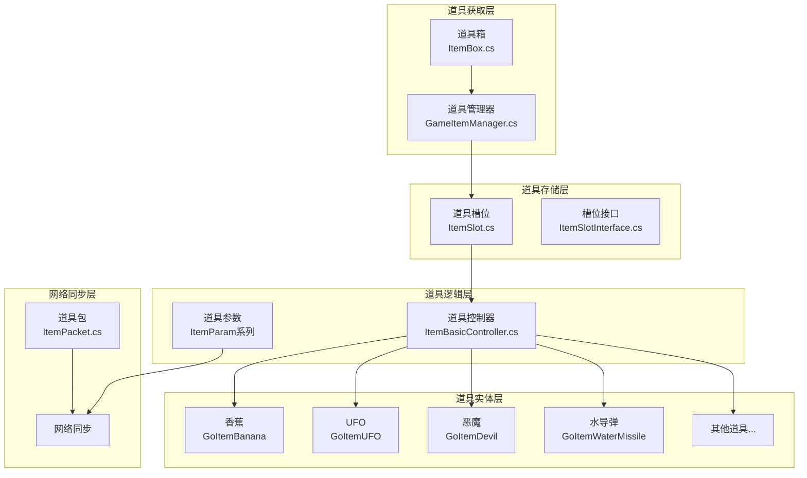
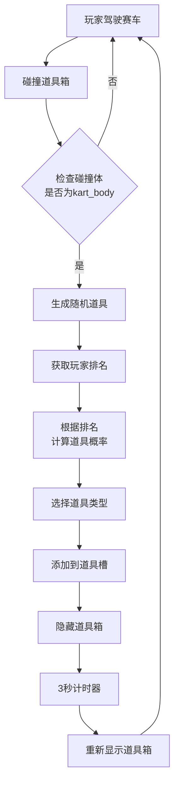
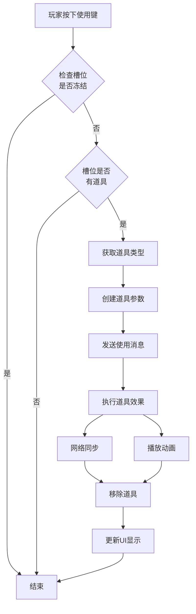
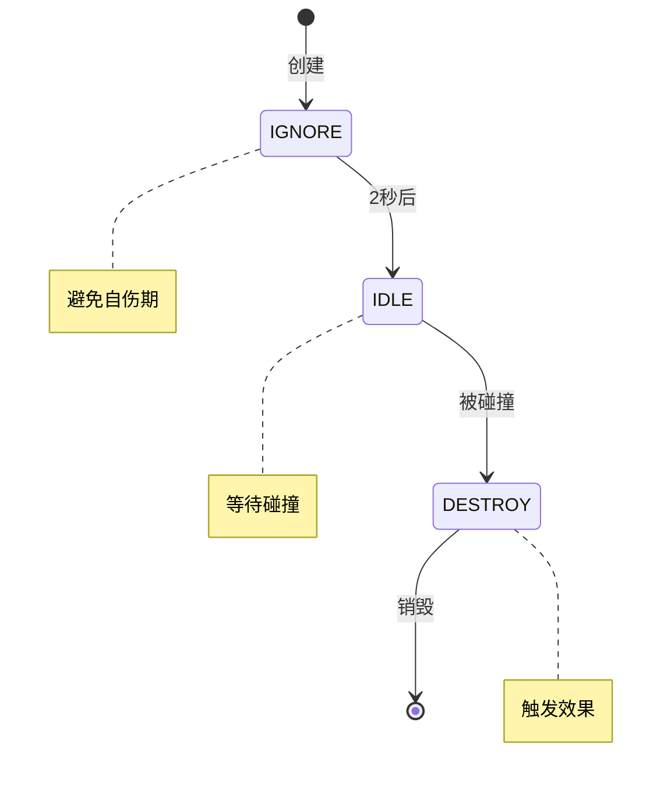
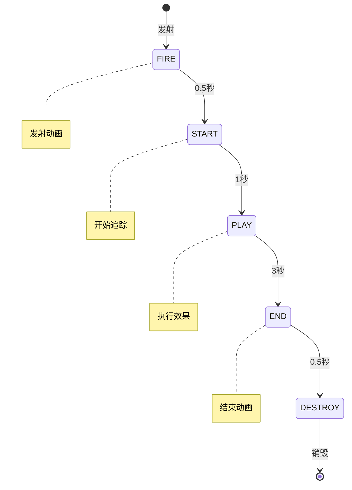
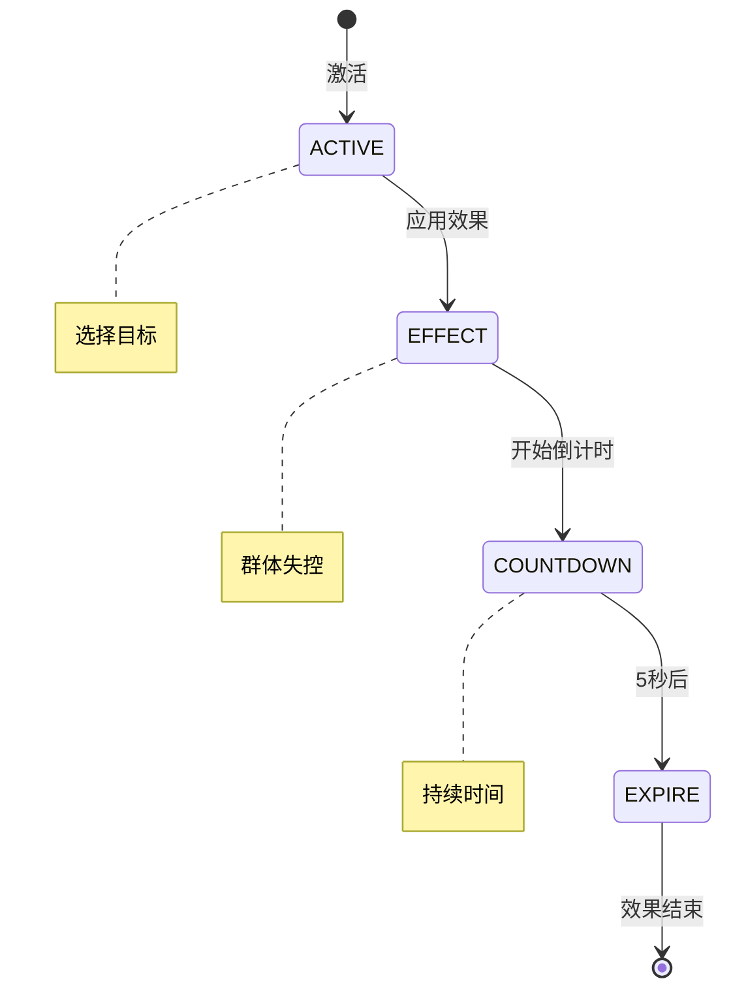
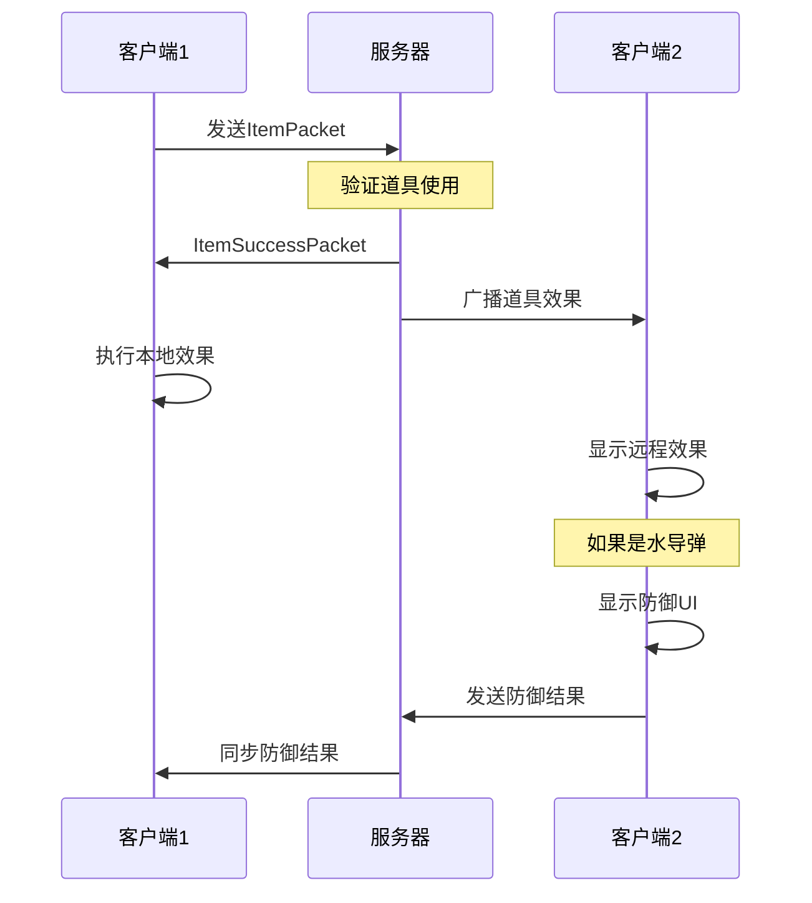
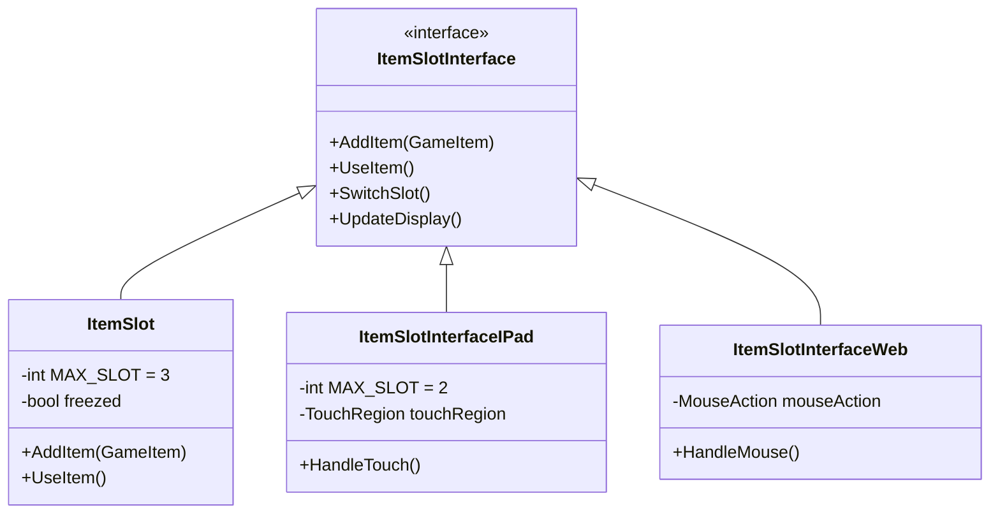
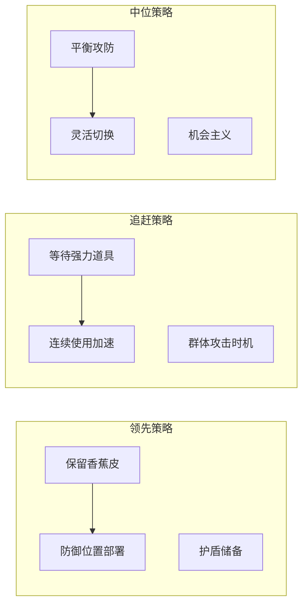

# 赛车游戏道具系统完整文档

## 1. 系统架构概览

### 1.1 核心模块关系图



### 1.2 系统层次结构表

| 层次 | 职责 | 核心类 | 功能描述 |
|------|------|--------|----------|
| **界面层** | 用户交互 | ItemSlot, ItemSlotInterface | 道具槽位显示、道具使用触发 |
| **控制层** | 行为管理 | ItemBasicController | 道具生命周期、状态管理 |
| **实体层** | 道具实现 | GoItem系列类 | 具体道具效果和动画 |
| **数据层** | 参数管理 | ItemParam系列类 | 道具数据序列化、网络传输 |
| **网络层** | 同步通信 | ItemPacket, ItemSuccessPacket | 多人游戏道具同步 |
| **获取层** | 道具生成 | ItemBox, GameItemManager | 道具箱交互、随机生成 |

## 2. 道具获取流程

### 2.1 道具箱碰撞检测流程



### 2.2 道具生成概率表

#### 2人游戏概率分配

| 道具类型 | 第1名 | 第2名 |
|----------|-------|-------|
| BANANA | 60% | 10% |
| UFO | 0% | 10% |
| DEVIL | 0% | 10% |
| WATER_MISSILE | 10% | 10% |
| WATER_BOMB | 10% | 10% |
| WATER_FLY | 10% | 10% |
| FLIP | 0% | 10% |
| BOOSTER | 10% | 30% |

#### 3人游戏概率分配

| 道具类型 | 第1名 | 第2名 | 第3名 |
|----------|-------|-------|-------|
| BANANA | 60% | 30% | 10% |
| UFO | 0% | 0% | 10% |
| DEVIL | 0% | 0% | 10% |
| WATER_MISSILE | 10% | 10% | 10% |
| WATER_BOMB | 10% | 20% | 10% |
| WATER_FLY | 10% | 20% | 10% |
| FLIP | 0% | 0% | 10% |
| BOOSTER | 10% | 20% | 30% |

#### 4-6人游戏概率分配

| 道具类型 | 第1名 | 第2-3名 | 第4-6名 |
|----------|-------|---------|---------|
| BANANA | 60% | 30% | 10% |
| UFO | 0% | 5% | 10% |
| DEVIL | 0% | 5% | 10% |
| WATER_MISSILE | 10% | 10% | 10% |
| WATER_BOMB | 10% | 20% | 10% |
| WATER_FLY | 10% | 20% | 10% |
| FLIP | 0% | 0% | 10% |
| BOOSTER | 10% | 10% | 30% |

## 3. 道具使用机制

### 3.1 道具使用流程图



### 3.2 道具槽位管理

| 属性 | 说明 | 默认值 |
|------|------|--------|
| MAX_SLOT | 最大槽位数 | 3 |
| currentSlot | 当前选中槽位 | 0 |
| slotSize | 槽位尺寸类型 | NORMAL |
| freezed | 冻结状态 | false |
| isItemOn | 道具是否可用 | true |

## 4. 道具效果详解

### 4.1 道具类型和效果表

| 道具名称 | 类型 | 效果描述 | 持续时间 | 目标 |
|----------|------|----------|----------|------|
| **香蕉皮** | 陷阱 | 导致踩中者打滑失控 | - | 单体 |
| **UFO** | 攻击 | 追踪目标并减速 | 3秒 | 单体 |
| **恶魔** | 群体 | 使多个目标失控 | 5秒 | 群体 |
| **水导弹** | 交互 | 可防御的追踪攻击 | - | 单体 |
| **水炸弹** | 范围 | 范围爆炸效果 | - | 范围 |
| **水苍蝇** | 干扰 | 视野干扰 | - | 单体 |
| **翻转** | 控制 | 翻转目标控制 | - | 单体 |
| **加速器** | 增益 | 提供加速效果 | - | 自身 |
| **护盾** | 防御 | 抵挡一次攻击 | - | 自身 |

### 4.2 道具状态机

#### 香蕉皮状态机



#### UFO状态机



#### 恶魔道具状态机



### 4.3 道具交互矩阵

| 道具 | 可被护盾防御 | 可被水导弹拦截 | 影响驾驶 | 影响视野 |
|------|--------------|----------------|----------|----------|
| 香蕉皮 | ✓ | ✗ | ✓ | ✗ |
| UFO | ✓ | ✓ | ✓ | ✗ |
| 恶魔 | ✗ | ✗ | ✓ | ✗ |
| 水导弹 | ✓ | ✗ | ✓ | ✗ |
| 水炸弹 | ✓ | ✗ | ✓ | ✗ |
| 水苍蝇 | ✓ | ✗ | ✗ | ✓ |
| 翻转 | ✗ | ✗ | ✓ | ✗ |

## 5. 网络同步机制

### 5.1 网络同步流程



### 5.2 数据包结构

#### ItemPacket 结构

| 字段 | 类型 | 说明 |
|------|------|------|
| itemType | GameItem | 道具类型 |
| useTime | float | 使用时间戳 |
| targetId | int | 目标玩家ID |
| position | Vector3 | 使用位置 |
| rotation | Quaternion | 使用朝向 |
| params | ItemParam | 道具参数 |

#### ItemSuccessPacket 结构

| 字段 | 类型 | 说明 |
|------|------|------|
| success | bool | 是否成功 |
| reason | string | 失败原因 |
| effectIds | int[] | 受影响玩家 |

## 6. 平台适配

### 6.1 平台差异对比

| 特性 | 标准版 | iPad版 | Web版 |
|------|--------|--------|-------|
| 槽位数量 | 3 | 2 | 3 |
| 触控支持 | ✗ | ✓ | ✗ |
| 水导弹防御 | 键盘 | 触摸 | 鼠标 |
| UI布局 | 横向 | 纵向 | 横向 |
| 道具切换 | Tab键 | 滑动 | Tab键 |

### 6.2 平台接口继承关系



## 7. 道具平衡性设计

### 7.1 平衡机制

1. **动态概率系统**
   - 落后玩家获得强力道具概率更高
   - 领先玩家主要获得防御型道具

2. **道具克制关系**
   - 护盾可防御大部分攻击
   - 水导弹可被玩家主动防御
   - 恶魔效果无法被防御（平衡强度）

3. **冷却和限制**
   - 最多持有3个道具
   - 道具箱3秒重生时间
   - 部分道具有持续时间限制

### 7.2 策略深度



## 8. 扩展性设计

### 8.1 添加新道具流程

1. **创建道具参数类**
   ```csharp
   public class ItemNewParam : ItemParam {
       // 道具特定参数
   }
   ```

2. **创建道具GameObject类**
   ```csharp
   public class GoItemNew : ItemBasicController {
       // 道具行为实现
   }
   ```

3. **注册到GameItem枚举**
   ```csharp
   public enum GameItem {
       // ... 现有道具
       NEW_ITEM = 10
   }
   ```

4. **配置概率表**
   - 在GameItemManager中添加概率配置

5. **添加UI资源**
   - 道具图标
   - 动画效果

### 8.2 模块化架构优势

- **低耦合**: 各层次独立，易于维护
- **高内聚**: 功能模块职责明确
- **可测试**: 各模块可独立测试
- **可扩展**: 新道具添加不影响现有系统

## 9. 性能优化

### 9.1 优化策略

| 优化项 | 实现方式 | 效果 |
|--------|----------|------|
| 对象池 | 道具预创建和重用 | 减少GC压力 |
| 位掩码 | 恶魔效果目标标记 | 减少网络传输 |
| 状态缓存 | 避免重复计算 | 提升帧率 |
| LOD系统 | 远距离简化效果 | 降低渲染负载 |

## 10. 总结

道具系统是赛车游戏的核心玩法系统之一，通过精心设计的架构实现了：

- ✅ **丰富的游戏性**: 9种不同效果的道具
- ✅ **公平的竞技性**: 动态平衡机制
- ✅ **流畅的网络体验**: 高效同步方案
- ✅ **良好的扩展性**: 模块化设计
- ✅ **跨平台兼容**: 统一接口适配

该系统为玩家提供了策略深度和娱乐性，是提升游戏可玩性的关键要素。